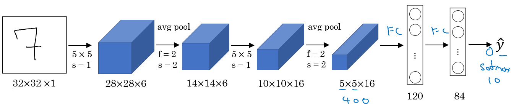
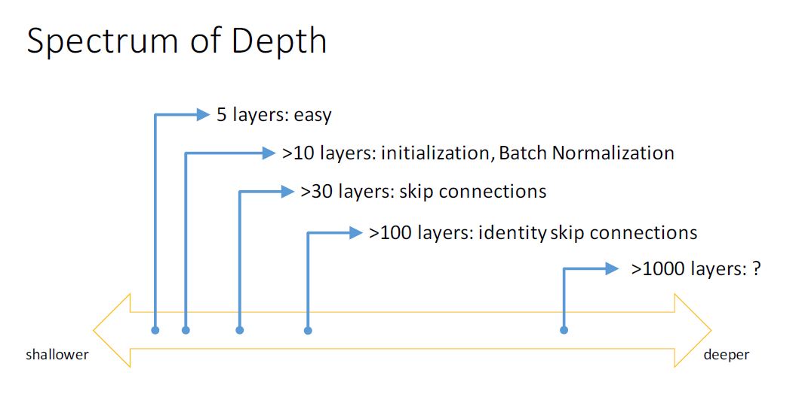
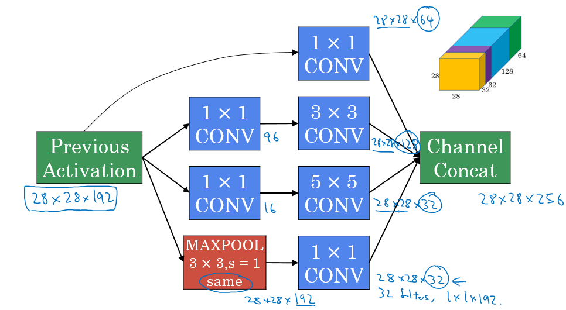
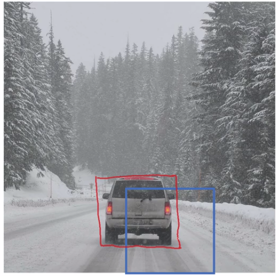
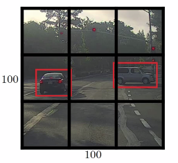
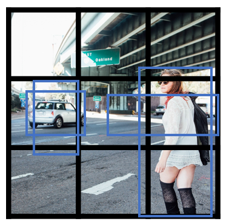
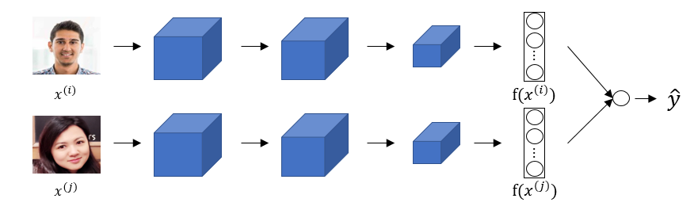
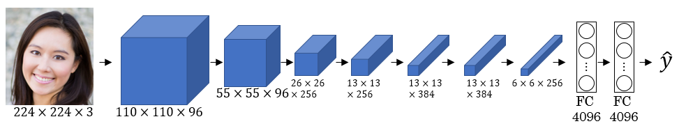
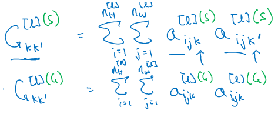

# Convolutional Neural Networks

## Table of contents

* [Convolutional Neural Networks](#convolutional-neural-networks)
   * [Table of contents](#table-of-contents)
   * [Course summary](#course-summary)
   * [Foundations of CNNs](#foundations-of-cnns)
      * [Computer vision](#computer-vision)
      * [Edge detection example](#edge-detection-example)
      * [Padding](#padding)
      * [Strided convolution](#strided-convolution)
      * [Convolutions over volumes](#convolutions-over-volumes)
      * [One Layer of a Convolutional Network](#one-layer-of-a-convolutional-network)
      * [A simple convolution network example](#a-simple-convolution-network-example)
      * [Pooling layers](#pooling-layers)
      * [Convolutional neural network example](#convolutional-neural-network-example)
      * [Why convolutions?](#why-convolutions)
   * [Deep convolutional models: case studies](#deep-convolutional-models-case-studies)
      * [Why look at case studies?](#why-look-at-case-studies)
      * [Classic networks](#classic-networks)
      * [Residual Networks (ResNets)](#residual-networks-resnets)
      * [Why ResNets work](#why-resnets-work)
      * [Network in Network and 1×1 convolutions](#network-in-network-and-1-X-1-convolutions)
      * [Inception network motivation](#inception-network-motivation)
      * [Inception network (GoogleNet)](#inception-network-googlenet)
      * [Using Open-Source Implementation](#using-open-source-implementation)
      * [Transfer Learning](#transfer-learning)
      * [Data Augmentation](#data-augmentation)
      * [State of Computer Vision](#state-of-computer-vision)
   * [Object detection](#object-detection)
      * [Object Localization](#object-localization)
      * [Landmark Detection](#landmark-detection)
      * [Object Detection](#object-detection-1)
      * [Convolutional Implementation of Sliding Windows](#convolutional-implementation-of-sliding-windows)
      * [Bounding Box Predictions](#bounding-box-predictions)
      * [Intersection Over Union](#intersection-over-union)
      * [Non-max Suppression](#non-max-suppression)
      * [Anchor Boxes](#anchor-boxes)
      * [YOLO Algorithm](#yolo-algorithm)
      * [Region Proposals (R-CNN)](#region-proposals-r-cnn)
   * [Special applications: Face recognition &amp; Neural style transfer](#special-applications-face-recognition--neural-style-transfer)
      * [Face Recognition](#face-recognition)
         * [What is face recognition?](#what-is-face-recognition)
         * [One Shot Learning](#one-shot-learning)
         * [Siamese Network](#siamese-network)
         * [Triplet Loss](#triplet-loss)
         * [Face Verification and Binary Classification](#face-verification-and-binary-classification)
      * [Neural Style Transfer](#neural-style-transfer)
         * [What is neural style transfer?](#what-is-neural-style-transfer)
         * [What are deep ConvNets learning?](#what-are-deep-convnets-learning)
         * [Cost Function](#cost-function)
         * [Content Cost Function](#content-cost-function)
         * [Style Cost Function](#style-cost-function)
         * [1D and 3D Generalizations](#1d-and-3d-generalizations)
   * [Extras](#extras)
      * [Keras](#keras)

## Course summary

> 이 과정은 컨볼루션 신경망을 구축하고 이미지 데이터에 적용하는 방법을 가르쳐줍니다. 딥 러닝 덕분에 컴퓨터 비전은 두 년 전보다 훨씬 더 효과적으로 작동하고 안전한 자율 주행부터 정확한 얼굴 인식, 방사선 영상의 자동 읽기까지 다양한 흥미로운 응용 프로그램을 가능하게 합니다.
<br><br>다음을 배우게 됩니다:<br><br>
잔여 신경망과 같은 최근 변형을 포함하여 컨볼루션 신경망을 구축하는 방법을 이해합니다.
컨볼루션 네트워크를 시각적 감지 및 인식 작업에 적용하는 방법을 알게 됩니다.
예술을 생성하기 위해 신경 스타일 전이를 사용하는 방법을 알게 됩니다.
이러한 알고리즘을 다양한 이미지, 비디오 및 기타 2D 또는 3D 데이터에 적용할 수 있습니다.
이것은 딥 러닝 특화 과정의 네 번째 과정입니다.


## CNN의 기초(Foundations of CNNs)

> CNN의 기본 레이어(풀링, 합성곱)를 구현하고, 다중 클래스 이미지 분류 문제를 해결하기 위해 깊은 신경망에서 올바르게 쌓는 방법을 배우실 것입니다.

---

### 컴퓨터 비전(Computer vision)

- 딥 러닝 덕분에 빠르게 활발한 응용 분야 중 하나인 컴퓨터 비전입니다.

- 딥 러닝을 사용하는 컴퓨터 비전의 응용 분야 중 일부는 다음과 같습니다:
  - 자율 주행 자동차.
  - 얼굴 인식.

- 딥 러닝은 새로운 종류의 예술을 만들 수 있도록 하고 있습니다.
- 컴퓨터 비전의 급속한 변화로 인해 몇 년 전에는 불가능했던 새로운 응용 프로그램이 가능해지고 있습니다.

- 컴퓨터 비전 딥 러닝 기술은 항상 진화하며 컴퓨터 비전 이외의 다른 영역에서도 도움이 되는 새로운 아키텍처를 만들고 있습니다.
  - 예를 들어, Andrew Ng는 컴퓨터 비전의 일부 아이디어를 차용하여 음성 인식에 적용했습니다.

- 컴퓨터 비전 문제의 예시는 다음과 같습니다:
  - 이미지 분류.
  - 물체 감지.
    - 물체 감지 및 그 위치를 파악합니다.
  - 신경 스타일 전이
    - 다른 이미지를 사용하여 이미지의 스타일을 변경합니다.

- 컴퓨터 비전 문제의 한 가지 어려움은 이미지가 매우 크다는 것이며, 빠르고 정확한 알고리즘을 사용해야 한다는 것입니다. 

- 예를 들어, 1000x1000 크기의 이미지는 완전히 연결된 신경망에 3백만개의 특성/입력을 나타냅니다. 다음 은닉층에 1000개가 포함된 경우, 첫 번째 레이어에는 30억 개의 매개변수를 학습해야 합니다. 이는 계산적으로 매우 비싼 작업입니다!
이 문제의 해결책 중 하나는 완전 연결 레이어 대신 합성곱 레이어를 사용하여 모델을 구축하는 것입니다.

---

### 엣지 검출 예제(Edge detection example)

- 컨볼루션 연산은 CNN(Convolutional Neural Network)의 기본 블록 중 하나입니다. 컨볼루션의 예로는 이미지 엣지(가장자리) 검출 작업이 있습니다.
- CNN의 초기 레이어는 주로 엣지를 검출할 수 있으며, 중간 레이어는 객체의 일부를 검출하고, 나중 레이어에서는 이러한 일부를 함께 결합하여 출력을 생성합니다.
- 이미지에서는 수직 엣지, 수평 엣지 또는 전체 엣지 검출이 가능합니다.
- 수직 엣지 검출:
  - 수직 엣지 검출을 위한 컨볼루션 연산의 예:
    - 
  - 마지막 예에서 6x6 행렬이 3x3 필터 또는 커널과 컨볼루션되어 4x4 행렬을 생성합니다.
  - TensorFlow에서 컨볼루션 연산을 수행하려면 tf.nn.conv2d 함수를 사용할 수 있습니다. Keras에서는 Conv2d 함수를 사용할 수 있습니다.
  - 수직 엣지 검출 필터는 이미지에서 밝은 영역 다음에 어두운 영역이 나타나는 3x3 위치를 찾습니다.
  - 이 필터를 백지역 다음에 어두운 영역이 나타나는 영역에 적용하면 두 색깔 사이의 가장자리를 양수 값으로 검출할 것입니다. 그러나 동일한 필터를 어두운 영역 다음에 밝은 영역에 적용하면 음수 값이 나올 것입니다. 이를 해결하기 위해 절댓값 함수(abs 함수)를 사용하여 값을 양수로 만들 수 있습니다.
<br><br>
- 수평 엣지 검출:
  - 다음과 같이 될 것입니다.

    ```
    1	1	1
    0	0	0
    -1	-1	-1
    ```

- 가로 또는 세로 엣지 검출에 숫자를 넣는 다양한 방법이 있습니다. 예를 들어, 다음은 수직 Sobel 필터의 예입니다 (아이디어는 중간 행을 고려하는 것입니다):

  ```
  1	0	-1
  2	0	-2
  1	0	-1
  ```

- "Scharr" 필터라고 불리는 것도 있습니다. (아이디어는 중간 행을 크게 고려하는 것입니다):

  ```
  3	0	-3
  10	0	-10
  3	0	-3
  ```

- 딥 러닝에서 우리가 배운 것은 이러한 숫자를 직접 설정할 필요가 없고, 그것들을 가중치로 취급하고 학습할 수 있다는 것입니다. 이것은 가로, 세로, 대각선 또는 어떤 엣지 유형이든 수동으로 설정하는 대신 자동으로 학습할 수 있습니다.

---

### 패딩 (Padding)

- 딥 뉴럴 네트워크를 사용하기 위해 패딩(padding)을 사용해야 합니다.
- 이전 섹션에서는 6x6 행렬이 3x3 필터 또는 커널과 컨볼루션되어 4x4 행렬을 생성한다는 것을 보았습니다.
- 일반적인 규칙을 적용하기 위해 행렬 nxn이 fxf 필터 또는 커널로 컨볼루션되면 n-f+1, n-f+1 행렬을 얻게 됩니다.
- 컨볼루션 작업은 f > 1이면 행렬을 축소시킵니다.
- 여러 번 컨볼루션 작업을 적용하려면 이미지가 축소되면 많은 데이터가 손실됩니다. 또한 이미지의 가장자리 픽셀은 이미지의 다른 픽셀보다 적게 사용됩니다.
- 따라서 컨볼루션의 문제점은 다음과 같습니다:
  - 출력을 축소합니다.
  - 가장자리에 있는 정보가 많이 삭제됩니다.
- 이러한 문제를 해결하기 위해 컨볼루션 전에 입력 이미지에 패딩을 추가하여 일부 행과 열을 추가합니다. 패딩 양을 P로 지칭하며 이미지의 상단, 하단, 좌측 및 우측에 삽입할 행/열 수입니다.
- 거의 모든 경우에 패딩 값은 0입니다.
- 이제 일반적인 규칙은 행렬 nxn이 fxf 필터 또는 커널로 컨볼루션되고 패딩 p가 주어지면 n+2p-f+1, n+2p-f+1 행렬을 생성한다는 것입니다.
- 만약 n = 6, f = 3 및 p = 1이라면 출력 이미지는 n+2p-f+1 = 6+2-3+1 = 6이 됩니다. 이미지의 크기를 유지합니다.
- 동일한 컨볼루션은 출력 크기가 입력 크기와 동일하도록 패딩된 컨볼루션입니다. 다음과 같은 방정식으로 주어집니다:

  ```
  P = (f-1) / 2
  ```

- 컴퓨터 비전에서는 일반적으로 f가 홀수인 경우가 많습니다. 그 이유 중 하나는 중심값을 가지기 때문입니다.

---
### 스트라이드 컨볼루션 (Strided Convolution)

- 스트라이드 컨볼루션은 CNNs에서 사용되는 또 다른 구성 요소입니다.

- 스트라이드를 S로 지칭하겠습니다.

- 컨볼루션 작업을 수행할 때 필터/커널을 컨볼루션할 때 픽셀 수를 알려주기 위해 S를 사용합니다. 이전 예에서는 S가 1이었습니다.

- 이제 일반적인 규칙은 다음과 같습니다:
  -  만약 행렬 nxn이 fxf 필터/커널과 패딩 p, 스트라이드 s와 함께 컨볼루션되면 (n+2p-f)/s + 1, (n+2p-f)/s + 1 행렬을 생성합니다.

- 경우에 따라 (n+2p-f)/s + 1이 분수일 수 있으며, 이 경우 이 값을 소수점 아래로 내림(rounding down)할 수 있습니다.

- 수학 교과서에서 컨볼루션 연산은 사용하기 전에 필터를 뒤집는 것으로 나타납니다. 우리가 하던 것은 교차 상관(correlation) 연산이라고 하며, 현재 딥 러닝의 최신 기술은 컨볼루션 연산으로 사용합니다.

- 동일한 컨볼루션은 출력 크기가 입력 크기와 동일하도록 패딩된 컨볼루션입니다. 이것은 다음과 같은 방정식으로 주어집니다:

  ```
  p = (n*s - n + f - s) / 2
  When s = 1 ==> P = (f-1) / 2
  ```
---
### 볼륨 상의 컨볼루션 (Convolutions over Volumes)

- 2D 이미지에서 컨볼루션의 작동 방식을 보았으니, 이제 3D 이미지 (RGB 이미지)에 컨볼루션을 적용하려면 어떻게 할지 알아봅시다.
- 높이, 너비 및 채널 수를 가진 이미지를 높이, 너비 및 동일한 채널 수를 가진 필터와 컨볼루션하려고 합니다. 이미지의 채널 수와 필터의 채널 수가 동일한 것에 유의하십시오.
- 이를 각 채널에 대해 쌓인 필터로 생각할 수 있습니다!
- 예시:
  - 입력 이미지: `6x6x3`
  - 필터: `3x3x3`
  - 결과 이미지:  `4x4x1`
  - 이 경우 p=0, s=1
- 이러한 출력은 여기서는 2D입니다.
- 다양한 특징이나 엣지를 감지하기 위해 여러 필터를 사용할 수 있습니다. 예시:
  - 입력 이미지:  `6x6x3`
  - 10개의 필터: `3x3x3`
  - 결과 이미지:  `4x4x10`
  - 이 경우 p=0, s=1

---
### 컨볼루션 네트워크의 하나의 레이어

- 먼저 주어진 입력에 일부 필터를 컨볼루션하고 각 필터 출력에 편향을 추가한 다음 결과의 RELU를 취합니다. 예시:
  - 입력 이미지: `6x6x3`         `# a0`
  - 10개 필터: `3x3x3`         `#W1`
  - 결과 이미지: `4x4x10`     `#W1a0`
  - '10x1' 크기의 b (편향)을 더하면 :  `4x4x10` 이미지      `#W1a0 + b`
  - RELU를 적용하면:  `4x4x10` 이미지                `#A1 = RELU(W1a0 + b)`
  - 이 경우 p=0, s=1
  - 힌트: 여기서 매개변수의 수는 (3x3x3x10) + 10 = 280입니다.
- 마지막 예는 CNN의 레이어를 형성합니다.
- 힌트: 입력의 크기와 관계없이 필터 크기가 동일하면 매개변수 수가 동일하므로, 과적합(overfitting)에 민감하지 않게 만듭니다.
- 여기 사용할 몇 가지 표기법입니다. 레이어 l이 컨볼루션 레이어인 경우:

  ```
  Hyperparameters
  f[l] = filter size
  p[l] = padding	# Default is zero
  s[l] = stride
  nc[l] = number of filters

  Input:  n[l-1] x n[l-1] x nc[l-1]	Or	 nH[l-1] x nW[l-1] x nc[l-1]
  Output: n[l] x n[l] x nc[l]	Or	 nH[l] x nW[l] x nc[l]
  Where n[l] = (n[l-1] + 2p[l] - f[l] / s[l]) + 1

  Each filter is: f[l] x f[l] x nc[l-1]

  Activations: a[l] is nH[l] x nW[l] x nc[l]
  		     A[l] is m x nH[l] x nW[l] x nc[l]   # In batch or minbatch training
  		     
  Weights: f[l] * f[l] * nc[l-1] * nc[l]
  bias:  (1, 1, 1, nc[l])
  ```
---
### 간단한 컨볼루션 네트워크 예제

- 큰 예제를 만들어 봅시다.

	- 입력 이미지: a0 = 39x39x3
		- n0 = 39이고 nc0 = 3
	- 첫 번째 레이어 (컨볼루션 레이어):
		- f1 = 3, s1 = 1, p1 = 0
		- 필터 수 = 10
		- 결과는 a1 = 37x37x10
		- n1 = 37이고 nc1 = 10
	- 두 번째 레이어 (컨볼루션 레이어):
		- f2 = 5, s2 = 2, p2 = 0
		- 필터 수 = 20
		- 결과는 a2 = 17x17x20
			- n2 = 17, nc2 = 20
		- 힌트: 스트라이드가 2이므로 축소가 훨씬 빠릅니다.
	- 세 번째 레이어 (컨볼루션 레이어):
		- f3 = 5, s3 = 2, p3 = 0
		- 필터 수 = 40
		- 결과는 a3 = 7x7x40
			- n3 = 7, nc3 = 40
	- 네 번째 레이어 (완전 연결 소프트맥스)
		- a3 = 7x7x40 = 1960 벡터로..
		
- 마지막 예에서 볼 수 있듯이 각 레이어를 통과할 때 이미지가 점점 작아지는 경향이 있습니다.
- 컨볼루션 네트워크의 레이어 유형:
	- 컨볼루션 레이어. #Conv
	- 풀링 레이어 #Pool
	- 완전 연결 레이어 #FC
---
### 풀링 레이어 (Pooling Layers)
- 컨볼루션 레이어 외에도 CNN은 종종 입력 크기를 줄이고 계산 속도를 높이며 감지한 일부 특징을 보다 견고하게 만들기 위해 풀링 레이어를 사용합니다.

- Max 풀링의 예:
  
  - 이 예에서 f = 2, s = 2, p = 0 하이퍼파라미터를 가집니다.

- Max 풀링은 특징이 이 필터 어느 곳에서나 감지된 경우 해당 높은 숫자를 유지하도록 합니다. 그러나 사람들이 풀링을 사용하는 주요 이유는 실제로 잘 작동하며 계산을 줄일 수 있기 때문입니다.
- Max 풀링에는 학습할 매개변수가 없습니다.

- 3D 입력에 대한 Max 풀링의 예:
  - 입력: 4x4x10
  - Max 풀링 크기 = 2 및 스트라이드 = 2
  - 출력: 2x2x10
- Average 풀링은 최댓값 대신 값의 평균을 취하는 것입니다.
- 실제에서는 Max 풀링이 Average 풀링보다 더 자주 사용됩니다.
- 풀링의 스트라이드가 크기와 같으면, 축소 효과를 적용합니다.
- 하이퍼파라미터 요약
  - f : 필터 크기.
  - s : 스트라이드.
  - 여기서 패딩은 거의 사용되지 않습니다.
  - Max 또는 Average 풀링.
---
### 컨볼루션 신경망 예제

- 이제 전체 CNN 예제를 살펴보겠습니다. 이 예제는 Yann Lecun이 개발한 LeNet-5와 비슷한 것입니다.

	- 입력 이미지: a0 = 32x32x3
		- n0 = 32이고 nc0 = 3
          <br><br>
	- 첫 번째 레이어 (컨볼루션 레이어): #Conv1
		- f1 = 5, s1 = 1, p1 = 0
		- 필터 수 = 6
		- 결과는 a1 = 28x28x6
			- n1 = 28이고 nc1 = 6
		- 그런 다음 (Max 풀링) 적용: #Pool1
		- f1p = 2, s1p = 2
		- 출력은 a1 = 14x14x6
		<br><br>
	- 두 번째 레이어 (컨볼루션 레이어): #Conv2
		- f2 = 5, s2 = 1, p2 = 0
		- 필터 수 = 16
		- 결과는 a2 = 10x10x16
			- n2 = 10, nc2 = 16
		- 그런 다음 (Max 풀링) 적용: #Pool2
			- f2p = 2, s2p = 2
			- 출력은 a2 = 5x5x16
              <br><br>
	- 세 번째 레이어 (완전 연결) #FC3
		- 뉴런 수는 120
		- 출력은 a3 = 120 x 1 . 400은 5x5x16에서 나왔습니다.
          <br><br>
	- 네 번째 레이어 (완전 연결) #FC4
		- 뉴런 수는 84
		- 출력은 a4 = 84 x 1 .
          <br><br>
	다섯 번째 레이어 (소프트맥스)
	- 예를 들어 10개의 숫자를 식별해야 하는 경우 뉴런 수는 10입니다.
      <br><br>
- 힌트: Conv1과 Pool1은 하나의 레이어로 취급됩니다.<br><br>
- 마지막 예에 관한 몇 가지 통계:
  - 
  - 하이퍼파라미터가 많습니다. 각 값의 선택에는 나중에 논의할 가이드라인을 따르거나 문헌을 확인하고 몇 가지 아이디어와 숫자를 얻어야 합니다.
  - 보통 입력 크기는 레이어를 통과함에 따라 작아지고 필터 수는 증가합니다.
  - CNN은 일반적으로 하나 이상의 컨볼루션 (1개만이 아닌 위에 표시한 예처럼) 다음에 풀링이 따릅니다.
  - 완전 연결 레이어가 네트워크에서 가장 많은 매개변수를 가집니다.
  - 이러한 블록을 함께 사용하는 것을 고려할 때, 처음에는 다른 작업 예제를 살펴보고 직관을 얻는 것이 좋습니다.
---
### 왜 컨볼루션을 사용해야 하는가?

- 컨볼루션의 두 가지 주요 이점은 다음과 같습니다:
	- 매개변수 공유.
		- 이미지의 한 부분에서 유용한 특징 검출기(예: 수직 가장자리 검출기)는 이미지의 다른 부분에서도 유용할 것입니다.
	- 연결의 희소성.
		- 각 레이어에서 각 출력 값은 작은 수의 입력 값에만 의존하므로 번역 불변성(translation invariance)을 제공합니다.
	- 이 모든 것을 합치면 다음과 같습니다:
  - 
  
---
## 딥 컨볼루션 모델: 사례 연구

> 연구 논문에서 직접 배운 깊은 CNN에서 사용되는 실제 트릭과 방법을 배워봅니다.

### 왜 사례 연구를 살펴보는가?

- 우리는 컨볼루션 레이어, 풀링 레이어 및 완전 연결 레이어에 대해 배웠습니다. 컴퓨터 비전 연구자들은 이러한 레이어를 어떻게 조합해야 하는지에 대해 지난 몇 년 동안 연구했습니다.
- 직관을 얻으려면 만들어진 예시를 봐야 합니다.
- 어떤 과제에서 잘 작동하는 일부 신경망 구조는 다른 과제에서도 잘 작동할 수 있습니다.
- 몇 가지 고전적인 CNN 네트워크는 다음과 같습니다:
	- LeNet-5
	- AlexNet
	- VGG
- 지난 ImageNet 대회에서 우승한 최고의 CNN 아키텍처는 ResNet이라고 불리며 152개의 레이어를 가지고 있습니다!
- 또한 Google에서 만든 Inception이라는 아키텍처도 있으며, 여러분의 과제에 적용하고 학습하는 데 매우 유용합니다.
- 언급된 모델을 읽고 시도하면 여러분을 높여주고 과제를 해결하기 위한 아이디어를 많이 얻을 수 있습니다.
  <br><br>
### 고전적인 네트워크

- 이 섹션에서는 LeNet-5, AlexNet, 그리고 VGG와 같은 고전적인 네트워크에 대해 이야기하겠습니다.

- **LeNet-5**

  - 이 모델의 목표는 32x32x1 회색 이미지에서 필기 숫자를 식별하는 것이었습니다. 다음은 그림입니다:
  - 
  - 이 모델은 1998년에 발표되었습니다. 그 당시에는 마지막 레이어에서 소프트맥스를 사용하지 않았습니다.
  - 60,000개의 매개변수를 가지고 있습니다.
  - 이미지의 차원이 증가함에 따라 채널 수가 증가합니다.
  - Conv ==> Pool ==> Conv ==> Pool ==> FC ==> FC ==> 소프트맥스와 같은 배치 유형은 매우 일반적합니다.
  - 논문에서 사용된 활성화 함수는 Sigmoid와 Tanh였습니다. 현대적인 구현에서는 대부분 RELU를 사용합니다.
  - [[LeCun et al., 1998. Gradient-based learning applied to document recognition]](http://ieeexplore.ieee.org/document/726791/?reload=true)
    <br><br>
- **AlexNet**

  - 이 논문의 제1 저자인 Alex Krizhevsky의 이름을 딴 모델입니다. 다른 저자로는 Geoffrey Hinton 등이 포함되었습니다.

  - 모델의 목표는 이미지를 1000개의 클래스로 분류하는 ImageNet 챌린지였습니다. 다음은 모델의 그림입니다:

  

  - 요약:

    ```
    Conv => Max-pool => Conv => Max-pool => Conv => Conv => Conv => Max-pool ==> Flatten ==> FC ==> FC ==> Softmax
    ```

  - LeNet-5와 유사하지만 더 큽니다.

  - 60만 개의 매개변수를 가지고 있습니다. 이는 LeNet-5의 60,000개의 매개변수와 비교하면 큰 차이가 있습니다.

  - RELU 활성화 함수를 사용했습니다.

  - 원래 논문에는 여러 개의 GPU와 지역 응답 정규화(Local Response Normalization, RN)가 포함되어 있습니다.

	  - 여러 GPU가 사용된 이유는 그 당시에는 GPU가 그리 빠르지 않았기 때문입니다.
	  - 연구자들은 지역 응답 정규화가 크게 도움이 되지 않는 것을 증명했으므로 현재는 이해하거나 구현하는 것을 신경 쓰지 않아도 됩니다.
  - 이 논문은 컴퓨터 비전 연구자들에게 딥 러닝이 얼마나 중요한지를 확신시켰습니다.

  - [[Krizhevsky et al., 2012. ImageNet classification with deep convolutional neural networks]](https://papers.nips.cc/paper/4824-imagenet-classification-with-deep-convolutional-neural-networks.pdf)
    <br><br>
- **VGG-16**

  - AlexNet의 수정판입니다.
  - 많은 하이퍼파라미터를 갖는 대신 더 단순한 네트워크를 가지도록 중점을 뒀습니다.
  - 다음 블록만 사용하는 것에 중점을 두었습니다:
	  - CONV = 3 x 3 필터, s = 1, same
	  - MAX-POOL = 2 x 2 , s = 2
  - 아래는 아키텍처입니다:
    - 
  - 이 네트워크는 현대 기준으로도 큰 편입니다. 약 1억 3,800만 개의 매개변수를 가지고 있습니다.
	  - 대부분의 매개변수는 완전 연결 레이어에 있습니다.
  - 순방향 전파를 위해 이미지 당 총 96MB의 메모리가 필요합니다!
	  - 대부분의 메모리는 초기 레이어에 있습니다.
  - 필터의 수는 64에서 128로, 그리고 256으로, 마지막으로 512로 증가합니다. 512는 두 번 사용되었습니다.
  - 차원 축소를 처리하는 유일한 역할을 하는 것은 풀링입니다.
  - VGG-19라고 하는 다른 버전도 있지만 대부분의 사람들은 VGG-19 대신 VGG-16을 사용합니다.
  - VGG 논문은 CNN을 사용하는 데 규칙을 만드는 데 도움이 되기 때문에 매력적입니다.
  - [[Simonyan & Zisserman 2015. Very deep convolutional networks for large-scale image recognition]](https://arxiv.org/abs/1409.1556)
---
### 잔차 네트워크 (ResNets)

- 아주, 아주 깊은 신경망은 기울기 소실과 기울기 폭발 문제로 인해 훈련하기 어렵습니다.

- 이 섹션에서는 스킵 연결(skip connection)에 대해 배우게 되는데, 이를 통해 레이어 수가 100개 이상인 대규모 신경망을 훈련할 수 있게 됩니다.
- **잔차 블록 (Residual block)**
  - ResNets는 일부 잔차 블록으로 구성됩니다.
  - 
  - 두 번째 활성화 함수 앞에 바로 연결을 추가합니다.
  - 이 블록의 저자들은 이 블록을 쌓아 더 깊은 신경망을 훈련할 수 있다고 발견했습니다.
  - [[He et al., 2015. Deep residual networks for image recognition]](https://arxiv.org/abs/1512.03385)
- **잔차 네트워크 (Residual Network)**
  - 일부 잔차 블록으로 구성된 신경망입니다.
  - 
  - 이 네트워크는 성능에 영향을 주지 않고 더 깊게 갈 수 있습니다. 일반 신경망인 평범한 네트워크(Plain networks)의 이론에 따르면 더 깊게 갈수록 문제를 더 잘 해결할 것이라고 말하지만, 기울기 소실과 기울기 폭발 문제로 인해 네트워크의 성능이 나빠집니다. 잔차 네트워크 덕분에 이제 원하는 만큼 깊게 갈 수 있습니다.
  - 
  - 왼쪽에는 평범한 네트워크가, 오른쪽에는 ResNet이 있습니다. 네트워크가 더 깊어짐에 따라 ResNet의 성능이 향상되는 것을 볼 수 있습니다.
  - 일부 경우에는 더 깊게 가는 것이 성능에 영향을 미치지 않을 수 있으며, 이는 손에 있는 문제에 따라 다릅니다.
  - 일부 사람들은 1000개 레이어를 훈련하려고 하지만 실제로는 사용하지 않습니다.
  - [He et al., 2015. Deep residual networks for image recognition]
---
### ResNets가 왜 동작하는가

- ResNet이 왜 동작하는지 설명하는 몇 가지 예를 살펴보겠습니다.

  - 다음과 같이 큰 신경망이 있다고 가정합니다.

    - `X --> Big NN --> a[l]`

  - 이 네트워크에 잔차 블록 두 개를 추가해 보겠습니다.

    - `X --> Big NN --> a[l] --> Layer1 --> Layer2 --> a[l+2]`
    - 그리고`[l]` 은`a[l+2]` 에 직접 연결됩니다.

  - RELU 활성화 함수를 사용한다고 가정하면:

    - ```
      a[l+2] = g( z[l+2] + a[l] )
      	   = g( W[l+2] a[l+1] + b[l+2] + a[l] )
      ```

  - 그런 다음 예를 들어 L2 정규화를 사용한다면, W[l+2]는 0이 될 것입니다. b[l+2]도 0이라고 가정해 봅시다.

  - 그러면 a[l+2] = g( a[l] ) = a[l]이 되며 음수 값이 없습니다.

  - 이것은 잔차 블록이 학습하기 쉬운 항등 함수(identity function)임을 보여주며, 이것이 더 깊은 신경망을 훈련시킬 수 있는 이유입니다.

  - 또한 추가한 두 레이어가 만든 큰 네트워크의 성능에 영향을 미치지 않음을 나타냅니다.

  - 힌트: ResNets에서 z[l+2]와 a[l]의 차원은 동일해야 합니다. 그렇지 않은 경우, 매트릭스 파라미터를 추가하여 차원을 일치시킬 수 있습니다(학습 가능하거나 고정된 것).

    - `a[l+2] = g( z[l+2] + ws * a[l] ) # 추가된 Ws는 차원을 일치시킴`
    - ws도 0 패딩일 수 있습니다.

- 스킵 연결 사용은 기울기가 역전파될 수 있도록 도와주며, 이로 인해 더 깊은 네트워크를 훈련할 수 있게 됩니다.
  <br><br>
- 이미지에서 ResNet을 살펴보겠습니다.
  - 다음은 ResNet-34의 아키텍처입니다:
  
  - 모든 3x3 Conv는 동일한 Conv입니다.
  - 네트워크 디자인은 간단하게 유지합니다.
  - spatial size /2 => # filters x2
  - FC 레이어나 드롭아웃은 사용되지 않습니다.
  - ResNet에는 주로 입력/출력 차원이 동일한지 아니면 다른지에 따라 두 가지 주요 유형의 블록이 사용됩니다. 이 두 가지 모두를 구현하게 될 것입니다.
  - 점선은 차원이 다른 경우입니다. 이를 해결하기 위해 입력을 2배로 다운샘플링하고 두 차원을 일치시키기 위해 제로 패딩을 추가합니다. 이를 해결하는 또 다른 트릭은 병목(bottleneck)입니다. 이에 대해 나중에 살펴볼 것입니다.
    <br><br>
- 유용한 개념 (깊이 스펙트럼):

  - 
  - Taken from [icml.cc/2016/tutorials/icml2016_tutorial_deep_residual_networks_kaiminghe.pdf](icml.cc/2016/tutorials/icml2016_tutorial_deep_residual_networks_kaiminghe.pdf)
    <br><br>
- 잔차 블록 유형:
  <br><br>
  - 항등 블록(Identity block):
    
    - Conv 앞에는 BN(Batch Normalization)이 있으며 RELU 이전에 적용됩니다. 차원은 여기서 동일합니다.
    - 이 스킵은 2개 레이어를 건너뜁니다. 스킵 연결은 2보다 큰 n 연결로 이동할 수 있습니다.
    - 이 그림은 [Keras](https://keras.io/) 레이어를 나타냅니다.
      <br><br>
  - 합성 블록(Convolutional block):
    
    - Conv는 병목(bottleneck) 1x1 Conv일 수 있습니다.
---
### Network in Network and 1 X 1 convolutions

- 1 x 1 합성곱(Convolution)은 "네트워크 인 네트워크(Network in Network)"라고도 불리며 많은 CNN 모델에서 유용하게 활용됩니다.

- 1 x 1 합성곱은 무엇을 하는 걸까요? 그냥 숫자를 곱하는 것이 아닌가요?

  - 먼저 다음 예제를 고려해 봅시다:
		- 입력: 6x6x1
		- 합성곱: 1x1x1 필터 하나. # 1 x 1 합성곱
		- 출력: 6x6x1
  - 다른 예제를 살펴봅시다:
		- 입력: 6x6x32
		- 합성곱: 1x1x32 5개 필터. # 1 x 1 합성곱
		- 출력: 6x6x5

- 네트워크 인 네트워크는 Lin et al., 2013. Network in network에서 제안되었습니다.

- 이 아이디어는 현대 CNN 모델에서 ResNet 및 Inception과 같은 다양한 모델에 사용되었습니다.

- 1 x 1 컨볼루션의 사용 사례:

  - 채널 수를 줄이고 싶을 때. 이를 "특성 변환"이라고도 합니다.
    - 위의 두 번째 예제에서 입력을 32에서 5개 채널로 줄였습니다.
  - 채널 수를 줄이면 계산량을 절약할 수 있습니다.
  - 입력 채널 수와 1 x 1 컨볼루션의 필터 수를 동일하게 지정하면 출력은 동일한 채널 수를 가집니다. 그런 다음 1 x 1 컨볼루션은 비선형성을 나타내며 비선형 연산을 학습할 수 있습니다.
- Yann LeCun은 완전 연결 레이어를 1 x 1 컨볼루션으로 대체할 수 있다고 믿습니다. 

  > Yann LeCun는 "Convolutional Nets에서 'fully-connected layers'라는 것은 존재하지 않는다. 1x1 컨볼루션 커널과 전체 연결 테이블만 존재한다."라고 주장했습니다. [Yann LeCun](https://www.facebook.com/yann.lecun/posts/10152820758292143) 

- [[Lin et al., 2013. Network in network]](https://arxiv.org/abs/1312.4400)
---
### 인셉션 네트워크 동기

- CNN을 설계할 때 모든 레이어를 직접 선택해야 합니다. 3 x 3 Conv, 5 x 5 Conv, 또는 맥스 풀링 레이어를 선택해야 할 때 여러 가지 선택 사항이 있습니다.
- 인셉션(Inception)이 제안하는 것은 이 모든 것을 한꺼번에 사용하는 것이 어떨까 하는 것입니다.
  <br><br>
- **Inception module**, 초기 버전:
  
  - 맥스 풀링이 동일한 것으로 나타납니다.
  - 인셉션 모듈의 입력은 28 x 28 x 192이며 출력은 28 x 28 x 256입니다.
  - 우리는 사용하고자 하는 모든 Conv와 풀링을 수행했고, 이제 신경망에 어떤 것을 가장 많이 사용할지 결정하게 할 것입니다.
  - [[Szegedy et al. 2014. Going deeper with convolutions]](https://arxiv.org/abs/1409.4842)
    <br><br>
- 인셉션 모델에서의 계산 비용 문제:
  - 이전 예에서 5 x 5 Conv에 집중했다고 가정해 봅시다.
  - 5 x 5 크기의 동일한 필터가 32개 있으며 입력은 28 x 28 x 192입니다.
  - 출력은 28 x 28 x 32여야 합니다.
  - 여기서 필요한 총 곱셈 작업 수는 다음과 같습니다:
	  - 출력 수 * 필터 크기 * 필터 크기 * 입력 차원
	  - 이는 28 * 28 * 32 * 5 * 5 * 192 = 1.2 억입니다.
	  - 1.2 억의 곱셈 작업은 현대 컴퓨터에서도 문제가 됩니다.
  - 1 x 1 컨볼루션을 사용하면 1.2 억을 단지 1200만으로 줄일 수 있습니다. 어떻게 할지 알아봅시다.
  - 계산 비용을 줄이기 위해 1 x 1 컨볼루션 사용:
	  - 새로운 아키텍처는 다음과 같습니다:
		  - X0 모양은 (28, 28, 192)입니다.
		  - 그런 다음 16개의 (1 x 1 컨볼루션)을 적용합니다.
		  - 이렇게 하면 모양이 (28, 28, 16)인 X1이 생성됩니다.
			- 여기서 차원이 줄어 들었습니다.
		  - 그런 다음 32개의 (5 x 5 컨볼루션)을 적용합니다.
		  - 이렇게 하면 모양이 (28, 28, 32)인 X2가 생성됩니다.
  - 이제 곱셈 작업 수를 계산해 봅시다:
	  - 첫 번째 컨볼루션에 대한 곱셈 작업: 28 * 28 * 16 * 1 * 1 * 192 = 250만
	  - 두 번째 컨볼루션에 대한 곱셈 작업: 28 * 28 * 32 * 5 * 5 * 16 = 1000만
	  - 따라서 총 곱셈 작업 수는 약 1250만 정도이며 1.2 억에 비해 매우 효율적입니다.
  - 여기서 1 x 1 컨볼루션을 병목(Bottleneck) BN이라고 합니다.
  - 1 x 1 컨볼루션이 성능에 영향을 미치지 않는다는 것이 밝혀졌습니다.
    <br><br>
- **Inception module**, 차원 축소 버전:
  - 
- Keras에서 인셉션 모델의 예제:
  - 
---
### 인셉션 네트워크 (GoogleNet)

- 인셉션 네트워크는 인셉션 모듈의 연결된 블록으로 구성됩니다.
- "인셉션"이라는 이름은 인셉션 영화에서 가져온 것이었습니다.
- 다음은 전체 모델입니다:
  
- 때로는 인셉션 모듈 앞에 맥스-풀링 블록이 사용되어 입력의 차원을 줄입니다.
- 네트워크의 목표로 향하도록 하는 데 도움이되는 서로 다른 위치에 3 개의 소프트맥스 브랜치가 있으며 중간 특징이 네트워크가 학습하는 데 충분히 좋은 것임을 보장합니다. 그리고 소프트맥스0과 소프트맥스1이 규칙화 효과를 제공한다는 것이 밝혀졌습니다.
- 인셉션 모듈의 개발 이후, 저자와 다른 사람들은 이 네트워크의 다른 버전을 만들었습니다. 인셉션 v2, v3, v4와 같은 것들이 있습니다. 또한 인셉션 모듈과 ResNet을 함께 사용한 네트워크도 있습니다.
- [[Szegedy et al., 2014, Going Deeper with Convolutions]](https://arxiv.org/abs/1409.4842)
---
### 오픈 소스 구현 사용

- 우리는 많은 신경망과 합성곱 신경망 아키텍처에 대해 배웠습니다.
- 이러한 신경망 중 많은 것들은 논문에 제시되지 않을 수 있는 세부 정보가 있기 때문에 복제하기 어려울 수 있습니다. 학습 감소, 매개변수 조정 등 다른 이유도 있습니다.
- 많은 딥 러닝 연구자들은 자신의 코드를 Github와 같은 사이트에 오픈 소스로 공개하고 있습니다.
- 연구 논문을 보고 이를 기반으로 구현하려면 먼저 해당 논문의 오픈 소스 구현을 찾아보는 것이 좋습니다.
- 이렇게 하는 장점 중 하나는 해당 네트워크 구현과 그 가중치/파라미터를 다운로드할 수 있을 수 있습니다. 저자는 이 결과를 얻기 위해 여러 GPU를 사용하고 몇 주 동안 노력했을 것이며, 다운로드한 후 여러분 앞에 있을 것입니다.
---
### 전이 학습 (Transfer Learning)
- 특정한 신경망 아키텍처를 사용하는 경우, 해당 사전 학습된 파라미터/가중치를 무작위 초기화 대신 사용하여 문제를 해결할 수 있습니다.
- 이는 신경망의 성능을 향상시키는 데 도움이 될 수 있습니다.
- 사전 학습된 모델은 ImageNet, Ms COCO, Pascal 등과 같은 대규모 데이터셋에서 훈련되었을 수 있으며 최적화된 하이퍼파라미터로 이러한 파라미터/가중치를 학습하는 데 많은 시간이 걸렸을 것입니다. 이렇게 하면 많은 시간을 절약할 수 있습니다.
  <br><br>
- 예를 들어보겠습니다:
	- 고양이 분류 문제가 있다고 가정해 봅시다. 이 문제에는 Tigger, Misty 및 아무도 아님이라는 3개의 클래스가 포함되어 있습니다.
	- 이러한 이미지로 신경망을 훈련시킬 데이터가 많지 않습니다.
	- Andrew는 온라인에서 좋은 신경망을 다운로드하고 그 가중치를 제거한 후 자신의 소프트맥스 활성화 레이어를 추가하고 다른 레이어의 가중치를 고정시킨 채로 새로운 레이어만 학습시키는 것을 권장합니다.
	- 프레임워크에서는 trainable = 0 또는 freeze = 0을 사용하여 일부 레이어의 파라미터를 고정시킬 수 있습니다.
	- 교육을 가속화하는 데 도움이 되는 속임수 중 하나는 최종 소프트맥스 레이어 없이 사전 학습된 신경망을 실행하고 이미지의 중간 표현을 얻어 디스크에 저장하는 것입니다. 그런 다음 이러한 표현을 얕은 신경망에 사용할 수 있습니다. 이렇게 하면 이미지를 모든 레이어를 통해 실행하는 데 필요한 시간을 절약할 수 있습니다.
		- 이는 이미지를 벡터로 변환하는 것과 유사합니다.
<br><br>
- 또 다른 예를 들어보겠습니다:
	- 지난 예에서 고양이에 대한 많은 사진이 있다면 어떻게 할까요.
	- 할 수 있는 한 가지는 사전 학습된 네트워크의 처음 몇 개 레이어를 고정시키고 네트워크의 다른 가중치를 학습하는 것입니다.
	- 다른 아이디어로는 고정되지 않은 레이어를 버리고 자체 레이어를 추가하는 것이 있습니다.
- 또 다른 예를 들어보겠습니다:
	- 충분한 데이터가 있는 경우, 사전 학습된 네트워크의 모든 레이어를 파인튜닝할 수 있지만 파라미터를 무작위로 초기화하지 말고 학습된 파라미터를 그대로 두고 거기서부터 학습할 수 있습니다.
---
### 데이터 증강 (Data Augmentation)

- 데이터가 증가하면 깊은 신경망(Deep Neural Network)의 성능이 향상됩니다. 데이터 증강은 깊은 학습이 깊은 신경망의 성능을 향상시키는 기술 중 하나입니다.
- 현재 대부분의 컴퓨터 비전 응용 프로그램은 더 많은 데이터가 필요합니다.
- 컴퓨터 비전 작업에 사용되는 일부 데이터 증강 방법은 다음과 같습니다:
	- 미러링(거울 상 반전).
	- 무작위 잘라내기.
		- 이 기술의 문제는 잘못된 잘라내기를 할 수 있다는 것입니다.
		- 이 문제를 해결하기 위한 방법은 자른 이미지를 충분히 크게 만드는 것입니다.
	- 회전.
	- 기울임.
	- 지역 왜곡.
	- 색상 변경.
		- 예를 들어, R, G 및 B에 왜곡을 추가하여 인간에게는 동일한 이미지로 인식되지만 컴퓨터에게는 다른 이미지로 인식되도록 합니다.
		- 실제로 추가되는 값들은 어떤 확률 분포에서 추출되며 이러한 변경사항은 매우 작습니다.
		- 이미지 내의 색상 변화에 대해 알고리즘을 더 견고하게 만듭니다.
		- 이러한 변경사항은 자동으로 필요한 시프트를 결정하는 PCA 색상 증강이라는 알고리즘이 있습니다.
- 훈련 중에 왜곡을 구현하는 방법:
	- 훈련 중에 왜곡된 미니 배치를 생성하기 위해 다른 CPU 스레드를 사용할 수 있습니다.
- 데이터 증강에는 하이퍼파라미터도 있습니다. 시작하기에 좋은 방법은 오픈 소스 데이터 증강 구현을 찾아보고 해당 하이퍼파라미터를 사용하거나 조정하는 것입니다.
---
### 컴퓨터 비전의 현황
- 특정 문제에는 적은 양의 데이터나 많은 양의 데이터가 있을 수 있습니다.
- 예를 들어 음성 인식 문제는 많은 양의 데이터가 있지만 이미지 인식은 중간 수준의 데이터가 있으며 객체 감지는 현재는 적은 양의 데이터가 있습니다.
- 데이터가 많은 경우 연구자들은 다음을 시도하는 경향이 있습니다:
	- 더 간단한 알고리즘 사용.
	- 덜한 손수 조정.
- 데이터가 그렇게 많지 않은 경우 사람들은 문제에 대해 더 많은 손수 조정을 시도합니다. "해킹"과 같은 방법을 선택합니다. 더 복잡한 신경망 구조를 선택하는 경우도 있습니다.
- 많은 컴퓨터 비전 문제에서 데이터가 충분히 많이 없기 때문에 손수 조정이 많이 의존됩니다.
- 다음 장에서는 객체 감지가 데이터가 적기 때문에 더 복잡한 신경망 구조가 제시될 것입니다.
- 벤치마크에서 성과를 높이는 팁:
	- 앙상블 사용.
		- 여러 신경망을 독립적으로 훈련하고 그 결과를 평균화합니다. 몇 가지 분류기를 결합합니다.
		- 문제에 가장 적합한 아키텍처를 결정한 후 일부를 무작위로 초기화하고 독립적으로 훈련합니다.
		- 이렇게 하면 성능을 약 2% 향상시킬 수 있습니다.
		- 그러나 이로 인해 앙상블의 수만큼 생산 속도가 느려지며 모든 모델을 메모리에 저장하므로 더 많은 메모리가 필요합니다.
		- 경쟁에서는 이를 사용하지만 실제 생산에서는 이를 사용하는 경우가 적습니다.
	- 테스트 시 다중 크롭.
		- 테스트 이미지의 여러 버전에서 분류기를 실행하고 결과를 평균화합니다.
		- 이 기술을 사용하는 "10 크롭"이라는 기술도 있습니다.
		- 이렇게 하면 생산에서 더 나은 결과를 얻을 수 있습니다.
- 오픈 소스 코드 사용
	- 문헌에 게시된 네트워크 아키텍처 사용.
	- 가능하면 오픈 소스 구현 사용.
	- 사전 훈련된 모델을 사용하고 데이터셋을 세밀하게 조정합니다.
---
## 객체 감지

> CNN 지식을 컴퓨터 비전의 가장 어려우면서 핫한 분야 중 하나인 객체 감지(Object Detection)에 어떻게 적용하는지 배우십시오.
---
### 객체 위치 파악

- 객체 감지는 지난 2년 동안 딥 러닝이 큰 성과를 거두는 분야 중 하나입니다.

- 위치 파악 및 감지란 무엇인가요?

  - **이미지 분류:**: 
    - 이미지를 특정 클래스로 분류합니다. 전체 이미지는 하나의 클래스를 나타냅니다. 정확한 위치를 알 필요가 없습니다. 일반적으로 하나의 객체만 표시됩니다.
    
<br><br>
  - **분류와 위치 파악:**:
    - 주어진 이미지에서 이미지의 클래스와 이미지 내 클래스의 위치를 학습하고자 합니다. 클래스를 감지하고 해당 객체가 있는 위치의 직사각형을 감지해야 합니다. 일반적으로 하나의 객체만 표시됩니다.
    
      <br><br>
  - **객체 감지:**:
    - 주어진 이미지에서 특정 클래스에 속하는 모든 객체를 감지하고 위치를 제공하려고 합니다. 이미지에는 다른 클래스의 여러 객체가 포함될 수 있습니다.
    
      <br><br>
  - **의미 분할:**:
    - 이미지의 각 픽셀을 범주 레이블로 표시하려고 합니다. 의미 분할은 인스턴스를 구분하지 않으며 픽셀만을 고려합니다. 객체를 감지하지 않고 픽셀만 식별합니다.
    - 동일한 클래스의 두 객체가 겹치는 경우 이를 구분할 수 없습니다.
    
      <br><br>
  - **인스턴스 분할:**
    - 이는 전체 문제와 유사합니다. 바운딩 박스를 예측하는 대신 어떤 픽셀 레이블을 예측하려면 인스턴스를 구분해야 합니다.
    
      <br><br>
  
- 이미지 분류를 수행하기 위해 우리는 Softmax가 달린 Conv Net을 사용합니다.

- 분류와 위치 파악을 수행하기 위해 우리는 Softmax가 달린 Conv Net과 이미지 내 클래스의 위치를 알려주는 네 개의 숫자 bx, by, bh, 그리고 bw를 사용합니다. 데이터셋은 클래스와 함께 이 네 개의 숫자를 포함해야 합니다.
  <br><br>
- 분류와 위치 파악 문제에서 목표 레이블 Y를 정의하는 방법:

  ```
    Y = [
      		Pc				# Probability of an object is presented
      		bx				# Bounding box
      		by				# Bounding box
      		bh				# Bounding box
      		bw				# Bounding box
      		c1				# The classes
      		c2
      		...
    ]
    ```

  - 예(객체가 있음):

    ```
      Y = [
        		1		# Object is present
        		0
        		0
        		100
        		100
        		0
        		1
        		0
      ]
      ```

  - 예(객체가 제시되지 않은 경우):

    ```
      Y = [
        		0		# Object isn't presented
        		?		# ? means we dont care with other values
        		?
        		?
        		?
        		?
        		?
        		?
      ]
      ```

- 생성한 Y에 대한 손실 함수(제곱 오차의 예)입니다:

  ```
    L(y',y) = {
      			(y1'-y1)^2 + (y2'-y2)^2 + ...           if y1 = 1
      			(y1'-y1)^2						if y1 = 0
    		}
    ```

  - 실제로는 `pc`에 로지스틱 회귀, 클래스에 대한 로그 가능성 후드 손실, 바운딩 박스에 제곱 오차를 사용합니다.
---
### 랜드마크 감지(Landmark Detection)

- 랜드마크 감지(Landmark Detection)는 컴퓨터 비전 문제 중 일부에서 점을 출력해야 할 수 있습니다. 이를 랜드마크 감지라고 합니다.

- 예를 들어, 얼굴 인식 문제에서 얼굴의 모서리, 눈의 모서리, 입의 모서리, 코의 모서리와 같은 얼굴의 지점을 원할 수 있습니다. 이는 얼굴의 포즈를 감지하는 데 도움이 될 수 있습니다.

- 얼굴 인식 문제에서 64개의 랜드마크를 출력해야 하는 경우, 다음과 같은 Y 모양의 출력을 얻을 수 있습니다:

  ```
    Y = [
      		THereIsAface				# 얼굴이 존재하는 확률 0 또는 1
      		l1x,
      		l1y,
      		....,
      		l64x,
      		l64y
    ]
    ```

- A다른 응용 프로그램은 사람의 몸에서 다양한 랜드마크/지점을 사용하여 사람의 스켈레톤을 얻어야 하는 경우입니다. 이는 일부 응용 프로그램에서 도움이 될 수 있습니다.

- 팁: 레이블링된 데이터에서 l1x, l1y가 왼쪽 눈의 모서리라면, 다른 예제의 모든 l1x, l1y는 동일해야 합니다.
---
### 객체 감지(Object Detection) 

- 객체 감지(Object Detection) 문제를 해결하기 위해 컨볼루션 신경망(Convolutional Neural Network)을 사용하며, 슬라이딩 윈도우 감지 알고리즘 기술을 사용합니다.
- 예를 들어 자동차 객체 감지 작업을 수행한다고 가정해 봅시다. 먼저 자동차 이미지 및 비자동차 이미지에서 잘린 자동차 이미지에 대한 컨볼루션 신경망을 훈련합니다.
  <br><br>
    
- 훈련이 완료된 후, 슬라이딩 윈도우 기술을 사용하여 이미지에서 객체를 감지합니다.
  <br><br>
- 슬라이딩 윈도우 감지 알고리즘:
  1. 직사각형 크기를 결정합니다.
  2. 이미지를 선택한 크기의 직사각형으로 나눕니다. 각 영역은 이미지를 전부 커버해야 합니다. 일부 스텝(strides)을 사용할 수 있습니다.
  3. 각 직사각형을 컨볼루션 신경망에 입력으로 제공하고, 그것이 자동차인지 아닌지 결정합니다.
  4. 더 크거나 작은 직사각형을 선택하고, 2에서 3까지의 프로세스를 반복합니다.
  5. 자동차를 포함하는 직사각형을 저장합니다.
  6. 두 개 이상의 직사각형이 교차하는 경우 정확도가 가장 높은 직사각형을 선택합니다.
- 슬라이딩 윈도우의 단점은 연산 시간이 많이 소요된다는 것입니다
- 머신 러닝이 아닌 딥러닝 이전 시대에는 손으로 제작한 선형 분류기를 사용하여 객체를 분류하고 슬라이딩 윈도우 기술을 사용했습니다. 선형 분류자는 계산이 저렴했습니다. 그러나 딥러닝 시대에는 딥러닝 모델의 복잡성으로 인해 계산 비용이 매우 높아졌습니다.
- 이 문제를 해결하기 위해 슬라이딩 윈도우를 컨볼루션적 접근으로 구현할 수 있습니다. 또 다른 아이디어는 딥러닝 모델을 압축하는 것입니다.
---
### 슬라이딩 윈도우의 컨볼루션 구현

- FC 레이어를 컨볼루션 레이어로 변환(네 가지 클래스에서 이미지 클래스 예측):
  
  - 위 이미지에서 볼 수 있듯이, FC 레이어를 입력의 너비와 높이와 동일한 필터의 너비와 높이로 컨볼루션을 사용하여 컨볼루션 레이어로 변환했습니다.
    <br><br>
- **슬라이딩 윈도우의 컨볼루션 구현:**:
  - 먼저 훈련한 Conv 네트워크가 다음과 같다고 가정해 봅시다(FC 레이어가 없음):
    
  - 이제 슬라이딩 윈도우를 적용해야 하는 16 x 16 x 3 이미지가 있다고 가정합니다. 이 이미지에 대해 이전 섹션에서 언급된 정상적인 구현을 사용하면 각 사각형의 크기가 16 x 16이고 Conv 네트워크를 네 번 실행해야 합니다.
    <br><br>
  - 컨볼루션 구현은 다음과 같습니다:
    
  - 간단히 말해서 이미지를 훈련한 동일한 Conv 네트워크에 공급했습니다.
  - 결과의 왼쪽 셀 "파란색"은 정상 구현의 첫 번째 슬라이딩 윈도우를 나타냅니다. 다른 셀은 다른 슬라이딩 윈도우를 나타냅니다.
  - 이 방법은 연산을 공유하기 때문에 더 효율적입니다.
    <br><br>
  - 다른 예제는 다음과 같습니다:
    
  - 이 예제는 계산을 공유하는 총 16개의 슬라이딩 윈도우가 있습니다.
  - [[Sermanet et al., 2014, OverFeat: Integrated recognition, localization and detection using convolutional networks]](https://arxiv.org/abs/1312.6229)
    <br><br>
- 이 알고리즘의 약점은 사각형의 위치가 정확하지 않을 수 있다는 것입니다. 원하는 객체와 정확하게 일치하지 않을 수 있습니다.
  
  - 빨간색으로 표시된 것은 원하는 사각형이고 파란색으로 표시된 것은 필요한 자동차 사각형입니다.
---
### 바운딩 박스 예측

- 마지막 섹션에서 설명한 알고리즘보다 더 나은 알고리즘은 YOLO 알고리즘[YOLO algorithm](https://arxiv.org/abs/1506.02640). 입니다.

- YOLO는 you only look once의 약자로 2015년에 개발되었습니다.
  <br><br>
- YOLO 알고리즘:

  

	1. 100 x 100 이미지가 있다고 가정해 봅시다.
	2. 이미지에 3 x 3 그리드를 배치합니다. 더 부드럽게 결과를 얻으려면 100 x 100 이미지에 19 x 19 그리드를 사용해야 합니다.
	3. 그리드의 각 섹션에 이전 섹션에서 논의한 분류 및 위치 결정 알고리즘을 적용합니다. bx와 by는 각 그리드의 객체 중심점을 나타내며 상자에 상대적이므로 범위는 0에서 1 사이입니다. bh와 bw는 객체의 높이와 너비를 나타내며 1.0 이상일 수 있지만 여전히 부동 소수점 값입니다.
	4. 컨볼루션 슬라이딩 윈도우로 한 번에 모두 수행합니다. 이전에 논의한 대로 Y 모양이 1 x 8이면 100 x 100 이미지의 출력은 3 x 3 x 8이어야 합니다. 이는 9개 셀 결과에 해당합니다.
	5. 예측된 위치 중간점을 사용하여 결과를 병합합니다.
       <br><br>
- 하나의 그리드 상자에 둘 이상의 객체를 찾은 경우 문제가 발생합니다.

- YOLO 알고리즘을 인기 있게 만드는 가장 큰 장점 중 하나는 빠른 속도와 컨볼루션 네트워크 구현이 가능하다는 것입니다.

- YOLO는 다른 객체 감지기와 어떻게 다른가요? YOLO는 객체를 분류하고 바운딩 박스를 사용하여 객체의 위치를 동시에 파악하기 위해 단일 CNN 네트워크를 사용합니다.

- 다음 섹션에서는 YOLO 알고리즘을 개선할 수 있는 몇 가지 아이디어를 살펴볼 것입니다.
---
### IoU (Intersection Over Union)

- ntersection Over Union은 객체 감지 알고리즘을 평가하는 데 사용되는 함수입니다.
- 이 함수는 두 경계 상자 간의 중첩을 측정합니다. 일반적으로 IoU는 두 바운딩 박스 간의 중첩 정도를 나타내는 측정입니다.
  <br><br>
- 예를 들어:
  - 
  - 빨간색이 레이블된 출력이고 보라색이 예측된 출력입니다.
  - Intersection Over Union을 계산하려면 먼저 두 직사각형의 합집합 영역을 계산합니다. 이것은 "첫 번째 직사각형 + 두 번째 직사각형"입니다. 그런 다음 이 두 직사각형 간의 교차 영역을 계산합니다.
  - 마지막으로 IoU = 교차 영역 / 합집합 영역입니다.
    <br><br>
- 만약 IoU >= 0.5라면 좋습니다. 최상의 답변은 1입니다.
- IoU가 높을수록 정확도가 더 높아집니다.
---
### 비최대 억제 (Non-max Suppression)

- YOLO에서 다중으로 객체를 감지하는 문제 중 하나는 동일한 객체을 여러 번 감지할 수 있다는 것입니다.
- 비최대 억제는 YOLO가 객체를 한 번만 감지하도록 하는 방법입니다.
  <br><br>
- 예를 들어:
  - 
  - 각 자동차에는 다른 확률로 두 번 이상 감지되는 경우가 있습니다. 이것은 객체의 중심점이라고 생각하는 그리드 중 일부에서 나옵니다.
    <br><br>
- 비최대 억제 알고리즘:
  1. 하나의 클래스를 대상으로 한다고 가정합시다.
  2. Y 모양은 [Pc, bx, by, bh, bw] 여야 합니다. 여기서 Pc는 해당 객체가 발생할 확률입니다.
  3. Pc < 0.6인 상자를 모두 삭제합니다.
  4. 남아 있는 상자가 있는 한:
	4.1. 예측으로서 가장 큰 Pc를 가진 상자를 선택합니다.
	4.2 이전 단계에서의 해당 상자와 IoU > 0.5인 모든 남아 있는 상자를 삭제합니다. 즉, 중첩이 높은 상자(0.5 이상의 중첩 임계값)를 가진 모든 상자를 삭제합니다.
     <br><br>
- 여러 클래스/객체 유형 c을 감지하려면 각 출력 클래스에 대해 비최대 억제를 c번 실행해야 합니다.
---
### 앵커 박스 (Anchor Boxes)

- YOLO에서 그리드는 하나의 객체만 감지합니다. 그리드 셀이 여러 객체를 감지하려면 어떻게 해야 할까요?
  - 
  - 여기에서 자동차와 사람 그리드는 같습니다.
  - 실제로 이런 일은 드물게 발생합니다.
<br><br>
- 앵커 박스(Anchor Boxes)의 아이디어는 이 문제를 해결하는 데 도움을 줍니다.
  <br><br>
- 만약 Y = [Pc, bx, by, bh, bw, c1, c2, c3]라면 두 개의 앵커 박스를 사용하려면 다음과 같이 합니다:
	- Y = [Pc, bx, by, bh, bw, c1, c2, c3, Pc, bx, by, bh, bw, c1, c2, c3] 단순히 하나의 앵커 Y를 반복했습니다.
	- 선택한 두 앵커 박스는 다음과 같은 모양으로 알려져야 합니다:
    - 
- 이전에 훈련 이미지의 각 객체는 해당 객체의 중점을 포함하는 그리드 셀에 할당됩니다.
- 두 개의 앵커 박스를 사용하는 경우, 훈련 이미지의 각 객체는 중점과 그리드 셀에 가장 높은 IoU를 가진 앵커 박스를 포함하는 그리드 셀에 할당됩니다. 객체가 어떤 앵커 박스에 가까운 사각형에 있어야 하는지 확인해야 합니다.
- 데이터의 예:
  - 
  - 여기서 자동차는 앵커 2에 가까웠습니다.
- 두 개 이상의 앵커 박스를 사용할 수 있지만 그 모양을 알아야 합니다.
	- 앵커 박스를 어떻게 선택하는지에 대한 방법은 사람들이 일반적으로 수동으로 선택했습니다. 자주 감지하는 객체 유형을 포함하는 다양한 모양을 갖는 다섯 개 또는 열 개의 앵커 박스 모양을 선택하는 방법일 수 있습니다.
	- 데이터 집합에서 k-means 알고리즘을 사용하여 이를 지정할 수도 있습니다.
- 앵커 박스를 사용하면 알고리즘을 특수화시킬 수 있으며, 우리 경우에는 더 넓은 이미지나 더 높은 이미지를 쉽게 감지할 수 있게 해줍니다.
---
### YOLO Algorithm

- YOLO는 빠르고 정확한 객체 감지 모델인 최신 기술입니다.

- 예를 통해 YOLO 알고리즘 전체를 요약하고 소개해 보겠습니다.

- 우리의 자율 주행 시스템을 위한 객체 감지를 수행해야 한다고 가정해 봅시다. 세 가지 클래스를 식별해야 합니다:

	1. 보행자 (지상을 걷는다).
	2. 자동차.
	3. 오토바이.
       <br><br>
- 우리는 두 개의 앵커 박스, 더 키워진 하나와 더 넓은 하나를 선택하기로 결정했습니다.

	- 실제로는 다섯 개 이상의 앵커 박스를 사용하며, 이들은 수동으로 선택하거나 k-평균을 사용하여 생성합니다.
- 레이블링된 Y의 모양은 [Ny, 그리드의 높이, 그리드의 너비, 16]이며, 여기서 Ny는 인스턴스 수이며 각 행 (크기 16)은 다음과 같습니다:

	[Pc, bx, by, bh, bw, c1, c2, c3, Pc, bx, by, bh, bw, c1, c2, c3]
- 데이터 집합은 이미지에 다중 레이블 및 각 레이블에 대한 직사각형을 포함하며, 우리는 Y의 모양과 값을 합의 대로 만들어야 합니다.
  <br><br>
	- 예시:
    - 
  - W먼저 모든 값을 0 및 ?로 초기화한 다음 각 레이블 및 직사각형에 대해 가장 가까운 그리드 포인트를 선택한 다음 그것을 채우는 모양과 IOU에 기반한 최적의 앵커 포인트를 선택합니다. 따라서 하나의 이미지에 대한 Y의 모양은 [그리드의 높이, 그리드의 너비, 16]이어야 합니다.
    <br><br>
- Conv 네트워크에서 레이블된 이미지를 훈련시킵니다. 우리의 경우 출력은 [그리드의 높이, 그리드의 너비, 16]이어야 합니다.

- 예측을 하려면 이미지에서 Conv 네트워크를 실행하고 각 클래스에 대해 비최대 억제 알고리즘을 실행합니다. 우리의 경우에는 3개의 클래스가 있습니다.
  <br><br>
	- 다음과 같이 어떤 것을 얻을 수 있습니다:
  
      <br><br>
    - 생성된 상자의 총 수는 그리드_너비 x 그리드_높이 x 앵커_수입니다. 즉, 3 x 3 x 2
  - 낮은 확률 예측을 제거하면 다음과 같아야 합니다:
    
    <br><br>
  - 그런 다음 최상의 확률을 얻은 다음 IOU 필터링을 수행합니다:
    

- YOLO는 작은 객체를 감지하는 데는 좋지 않습니다.

- [YOLO9000 Better, faster, stronger](https://arxiv.org/abs/1612.08242)

  - 요약:

  ```
    ________________________________________________________________________________________
    Layer (type)                     Output Shape          Param #     Connected to                
    ========================================================================================
    input_1 (InputLayer)             (None, 608, 608, 3)   0                                 
    ________________________________________________________________________________________
    conv2d_1 (Conv2D)                (None, 608, 608, 32)  864         input_1[0][0]         
    ________________________________________________________________________________________
    batch_normalization_1 (BatchNorm (None, 608, 608, 32)  128         conv2d_1[0][0]       
    ________________________________________________________________________________________
    leaky_re_lu_1 (LeakyReLU)        (None, 608, 608, 32)  0     batch_normalization_1[0][0] 
    ________________________________________________________________________________________
    max_pooling2d_1 (MaxPooling2D)   (None, 304, 304, 32)  0           leaky_re_lu_1[0][0]   
    ________________________________________________________________________________________
    conv2d_2 (Conv2D)                (None, 304, 304, 64)  18432       max_pooling2d_1[0][0] 
    ________________________________________________________________________________________
    batch_normalization_2 (BatchNorm (None, 304, 304, 64)  256         conv2d_2[0][0]       
    ________________________________________________________________________________________
    leaky_re_lu_2 (LeakyReLU)        (None, 304, 304, 64)  0     batch_normalization_2[0][0] 
    _______________________________________________________________________________________
    max_pooling2d_2 (MaxPooling2D)   (None, 152, 152, 64)  0           leaky_re_lu_2[0][0]   
    ________________________________________________________________________________________
    conv2d_3 (Conv2D)                (None, 152, 152, 128) 73728       max_pooling2d_2[0][0] 
    ________________________________________________________________________________________
    batch_normalization_3 (BatchNorm (None, 152, 152, 128) 512         conv2d_3[0][0]       
    ________________________________________________________________________________________
    leaky_re_lu_3 (LeakyReLU)        (None, 152, 152, 128) 0     batch_normalization_3[0][0] 
    ________________________________________________________________________________________
    conv2d_4 (Conv2D)                (None, 152, 152, 64)  8192        leaky_re_lu_3[0][0]   
    ________________________________________________________________________________________
    batch_normalization_4 (BatchNorm (None, 152, 152, 64)  256         conv2d_4[0][0]       
    ________________________________________________________________________________________
    leaky_re_lu_4 (LeakyReLU)        (None, 152, 152, 64)  0     batch_normalization_4[0][0] 
    ________________________________________________________________________________________
    conv2d_5 (Conv2D)                (None, 152, 152, 128) 73728       leaky_re_lu_4[0][0]   
    ________________________________________________________________________________________
    batch_normalization_5 (BatchNorm (None, 152, 152, 128) 512         conv2d_5[0][0]       
    ________________________________________________________________________________________
    leaky_re_lu_5 (LeakyReLU)        (None, 152, 152, 128) 0     batch_normalization_5[0][0] 
    ________________________________________________________________________________________
    max_pooling2d_3 (MaxPooling2D)   (None, 76, 76, 128)   0           leaky_re_lu_5[0][0]   
    ________________________________________________________________________________________
    conv2d_6 (Conv2D)                (None, 76, 76, 256)   294912      max_pooling2d_3[0][0] 
    _______________________________________________________________________________________
    batch_normalization_6 (BatchNorm (None, 76, 76, 256)   1024        conv2d_6[0][0]       
    ________________________________________________________________________________________
    leaky_re_lu_6 (LeakyReLU)        (None, 76, 76, 256)   0     batch_normalization_6[0][0] 
    _______________________________________________________________________________________
    conv2d_7 (Conv2D)                (None, 76, 76, 128)   32768       leaky_re_lu_6[0][0]   
    ________________________________________________________________________________________
    batch_normalization_7 (BatchNorm (None, 76, 76, 128)   512         conv2d_7[0][0]       
    _______________________________________________________________________________________
    leaky_re_lu_7 (LeakyReLU)        (None, 76, 76, 128)   0     batch_normalization_7[0][0] 
    ________________________________________________________________________________________
    conv2d_8 (Conv2D)                (None, 76, 76, 256)   294912      leaky_re_lu_7[0][0]   
    ________________________________________________________________________________________
    batch_normalization_8 (BatchNorm (None, 76, 76, 256)   1024        conv2d_8[0][0]       
    ________________________________________________________________________________________
    leaky_re_lu_8 (LeakyReLU)        (None, 76, 76, 256)   0     batch_normalization_8[0][0] 
    ________________________________________________________________________________________
    max_pooling2d_4 (MaxPooling2D)   (None, 38, 38, 256)   0           leaky_re_lu_8[0][0]   
    ________________________________________________________________________________________
    conv2d_9 (Conv2D)                (None, 38, 38, 512)   1179648     max_pooling2d_4[0][0] 
    ________________________________________________________________________________________
    batch_normalization_9 (BatchNorm (None, 38, 38, 512)   2048        conv2d_9[0][0]       
    ________________________________________________________________________________________
    leaky_re_lu_9 (LeakyReLU)        (None, 38, 38, 512)   0     batch_normalization_9[0][0] 
    ________________________________________________________________________________________
    conv2d_10 (Conv2D)               (None, 38, 38, 256)   131072      leaky_re_lu_9[0][0]   
    ________________________________________________________________________________________
    batch_normalization_10 (BatchNor (None, 38, 38, 256)   1024        conv2d_10[0][0]       
    ________________________________________________________________________________________
    leaky_re_lu_10 (LeakyReLU)       (None, 38, 38, 256)   0    batch_normalization_10[0][0]
    ________________________________________________________________________________________
    conv2d_11 (Conv2D)               (None, 38, 38, 512)   1179648    leaky_re_lu_10[0][0]   
    ________________________________________________________________________________________
    batch_normalization_11 (BatchNor (None, 38, 38, 512)   2048        conv2d_11[0][0]       
    ________________________________________________________________________________________
    leaky_re_lu_11 (LeakyReLU)       (None, 38, 38, 512)   0    batch_normalization_11[0][0]
    _______________________________________________________________________________________
    conv2d_12 (Conv2D)               (None, 38, 38, 256)   131072      leaky_re_lu_11[0][0] 
    ________________________________________________________________________________________
    batch_normalization_12 (BatchNor (None, 38, 38, 256)   1024        conv2d_12[0][0]       
    ________________________________________________________________________________________
    leaky_re_lu_12 (LeakyReLU)       (None, 38, 38, 256)   0   batch_normalization_12[0][0]
    ________________________________________________________________________________________
    conv2d_13 (Conv2D)               (None, 38, 38, 512)   1179648     leaky_re_lu_12[0][0] 
    ________________________________________________________________________________________
    batch_normalization_13 (BatchNor (None, 38, 38, 512)   2048        conv2d_13[0][0]       
    ________________________________________________________________________________________
    leaky_re_lu_13 (LeakyReLU)       (None, 38, 38, 512)   0    batch_normalization_13[0][0]
    ________________________________________________________________________________________
    max_pooling2d_5 (MaxPooling2D)   (None, 19, 19, 512)   0           leaky_re_lu_13[0][0] 
    _______________________________________________________________________________________
    conv2d_14 (Conv2D)               (None, 19, 19, 1024)  4718592     max_pooling2d_5[0][0] 
    ________________________________________________________________________________________
    batch_normalization_14 (BatchNor (None, 19, 19, 1024)  4096        conv2d_14[0][0]       
    ________________________________________________________________________________________
    leaky_re_lu_14 (LeakyReLU)       (None, 19, 19, 1024)  0    batch_normalization_14[0][0]
    ________________________________________________________________________________________
    conv2d_15 (Conv2D)               (None, 19, 19, 512)   524288      leaky_re_lu_14[0][0] 
    ________________________________________________________________________________________
    batch_normalization_15 (BatchNor (None, 19, 19, 512)   2048        conv2d_15[0][0]       
    ________________________________________________________________________________________
    leaky_re_lu_15 (LeakyReLU)       (None, 19, 19, 512)   0    batch_normalization_15[0][0]
    ________________________________________________________________________________________
    conv2d_16 (Conv2D)               (None, 19, 19, 1024)  4718592     leaky_re_lu_15[0][0] 
    ________________________________________________________________________________________
    batch_normalization_16 (BatchNor (None, 19, 19, 1024)  4096        conv2d_16[0][0]       
    ________________________________________________________________________________________
    leaky_re_lu_16 (LeakyReLU)       (None, 19, 19, 1024)  0    batch_normalization_16[0][0]
    ________________________________________________________________________________________
    conv2d_17 (Conv2D)               (None, 19, 19, 512)   524288      leaky_re_lu_16[0][0] 
    ________________________________________________________________________________________
    batch_normalization_17 (BatchNor (None, 19, 19, 512)   2048        conv2d_17[0][0]       
    ________________________________________________________________________________________
    leaky_re_lu_17 (LeakyReLU)       (None, 19, 19, 512)   0    batch_normalization_17[0][0]
    _______________________________________________________________________________________
    conv2d_18 (Conv2D)               (None, 19, 19, 1024)  4718592     leaky_re_lu_17[0][0] 
    ________________________________________________________________________________________
    batch_normalization_18 (BatchNor (None, 19, 19, 1024)  4096        conv2d_18[0][0]       
    ________________________________________________________________________________________
    leaky_re_lu_18 (LeakyReLU)       (None, 19, 19, 1024)  0    batch_normalization_18[0][0]
    ________________________________________________________________________________________
    conv2d_19 (Conv2D)               (None, 19, 19, 1024)  9437184     leaky_re_lu_18[0][0] 
    ________________________________________________________________________________________
    batch_normalization_19 (BatchNor (None, 19, 19, 1024)  4096        conv2d_19[0][0]       
    ________________________________________________________________________________________
    conv2d_21 (Conv2D)               (None, 38, 38, 64)    32768       leaky_re_lu_13[0][0]
    ________________________________________________________________________________________
    leaky_re_lu_19 (LeakyReLU)       (None, 19, 19, 1024)  0    batch_normalization_19[0][0]
    ________________________________________________________________________________________
    batch_normalization_21 (BatchNor (None, 38, 38, 64)    256         conv2d_21[0][0]       
    ________________________________________________________________________________________
    conv2d_20 (Conv2D)               (None, 19, 19, 1024)  9437184     leaky_re_lu_19[0][0]
    ________________________________________________________________________________________
    leaky_re_lu_21 (LeakyReLU)       (None, 38, 38, 64)    0    batch_normalization_21[0][0]
    ________________________________________________________________________________________
    batch_normalization_20 (BatchNor (None, 19, 19, 1024)  4096        conv2d_20[0][0]       
    ________________________________________________________________________________________
    space_to_depth_x2 (Lambda)       (None, 19, 19, 256)   0           leaky_re_lu_21[0][0] 
    ________________________________________________________________________________________
    leaky_re_lu_20 (LeakyReLU)       (None, 19, 19, 1024)  0    batch_normalization_20[0][0]
    ________________________________________________________________________________________
    concatenate_1 (Concatenate)      (None, 19, 19, 1280)  0         space_to_depth_x2[0][0] 
                                                                      leaky_re_lu_20[0][0] 
    ________________________________________________________________________________________
    conv2d_22 (Conv2D)               (None, 19, 19, 1024)  11796480    concatenate_1[0][0]   
    ________________________________________________________________________________________
    batch_normalization_22 (BatchNor (None, 19, 19, 1024)  4096        conv2d_22[0][0]       
    ________________________________________________________________________________________
    leaky_re_lu_22 (LeakyReLU)       (None, 19, 19, 1024)  0    batch_normalization_22[0][0]
    ________________________________________________________________________________________
    conv2d_23 (Conv2D)               (None, 19, 19, 425)   435625      leaky_re_lu_22[0][0] 
    ===============================================================================================
    Total params: 50,983,561
    Trainable params: 50,962,889
    Non-trainable params: 20,672
    _______________________________________________________________________________________________
    ```

- YOLO의 구현을 다음에서 찾을 수 있습니다:

  - https://github.com/allanzelener/YAD2K
  - https://github.com/thtrieu/darkflow
  - https://pjreddie.com/darknet/yolo/
---
### 영역 제안 (R-CNN)

- R-CNN은 객체 감지도 수행하는 알고리즘입니다.

- YOLO는 더 빠르다고 말합니다.

  > 우리의 모델은 분류기 기반 시스템보다 여러 가지 이점이 있습니다. 시험 시 전체 이미지를 살펴보므로 예측은 이미지의 전역 컨텍스트에 근거합니다. 또한 하나의 네트워크 평가로 예측을 생성하므로 R-CNN과 같이 하나의 이미지에 수천 개의 예측을 필요로 하는 시스템과 달리 굉장히 빠릅니다. 자세한 내용은 우리의 논문을 참조하십시오.

- 그러나 YOLO의 단점 중 하나는 객체가 존재하지 않는 많은 영역을 처리한다는 것입니다.

- **R-CNN**은 Conv Nets가 있는 지역을 나타냅니다.

- R-CNN은 Conv 네트워크 (확신 있는 분류기)를 실행하기 위해 몇 개의 창을 선택하려고 합니다.

- R-CNN이 창을 선택하기 위해 사용하는 알고리즘을 세그먼테이션 알고리즘이라고 합니다. 
이것은 다음과 같은 결과물을 출력합니다:<br><br>

  

- 예를 들어, 세그먼테이션 알고리즘이 2000개의 덩어리를 생성하면 이러한 덩어리 위에 분류기/CNN을 실행해야 합니다.
  <br><br>
- R-CNN을 더 빠르게 만들기 위해 많은 연구가 이루어졌습니다.

  - R-CNN:
    - 영역을 제안합니다. 하나씩 제안된 영역을 분류합니다.  Output 레이블  + 바운딩 박스.
    - 단점은 느립니다.
    - [[Girshik et. al, 2013. Rich feature hierarchies for accurate object detection and semantic segmentation]](https://arxiv.org/abs/1311.2524)
  - Fast R-CNN:
    - 영역을 제안합니다. 분류할 모든 제안된 영역에 대한 슬라이딩 윈도우의 컨볼루션 구현을 사용합니다.
    - [[Girshik, 2015. Fast R-CNN]](https://arxiv.org/abs/1504.08083)
  - Faster R-CNN:
    - 영역을 제안하기 위해 컨볼루션 네트워크를 사용합니다.
    - [[Ren et. al, 2016. Faster R-CNN: Towards real-time object detection with region proposal networks]](https://arxiv.org/abs/1506.01497)
  - Mask R-CNN:
    - https://arxiv.org/abs/1703.06870
      <br><br>
- 대부분의 Faster R-CNN 구현은 여전히 YOLO보다 느립니다.

- Andrew Ng는 YOLO의 아이디어가 더 낫다고 생각하는데, 이는 모든 작업을 한 번에 수행할 수 있기 때문입니다.

- 출력을 얻기 위한 한 번의 샷을 사용하는 다른 알고리즘에는 SSD와 MultiBox가 포함됩니다.

  - [[Wei Liu, et. al 2015 SSD: Single Shot MultiBox Detector]](https://arxiv.org/abs/1512.02325)
    <br><br>
- **R-FCN** 은 Faster R-CNN과 유사하지만 더 효율적입니다.

  - [[Jifeng Dai, et. al 2016 R-FCN: Object Detection via Region-based Fully Convolutional Networks ]](https://arxiv.org/abs/1605.06409)

## 특별한 응용: 얼굴 인식 및 신경 스타일 전이

> DCNN을 예술 생성 및 얼굴 인식을 포함한 여러 분야에 적용하는 방법을 알아보고, 직접 예술을 생성하고 얼굴을 인식하는 알고리즘을 구현해 보세요!
---
### 얼굴 인식

#### 얼굴 인식이란 무엇인가요?

- 얼굴 인식 시스템은 사람의 얼굴을 식별합니다. 이미지나 비디오에서 작동할 수 있습니다.
- 비디오 얼굴 인식 시스템 내에서의 라이브니스 감지는 네트워크가 이미지에서 얼굴을 식별하지 못하도록 합니다. 이것은 라이브인 사람과 라이브인 사람이 아닌 사람에 대한 데이터 세트를 사용하여 지도형 딥 러닝을 통해 학습할 수 있으며, 시퀀스 학습도 가능합니다.
  <br><br>
- 얼굴 확인 vs. 얼굴 인식:
  - 확인:
    - 입력: 이미지, 이름/ID. (1 : 1)
    - 출력: 입력 이미지가 주장된 사람의 것인지 여부.
    - "이 사람이 주장하는 사람인가요?"
  - 인식:
    - K 명의 사람 데이터베이스가 있습니다.
    - 입력 이미지를 가져옵니다.
    - 이미지가 K 명 중 어떤 사람인지 인식하고 해당 사람의 ID를 출력합니다(또는 인식되지 않음).
    - "이 사람은 누구인가요?"
      <br><br>
- 얼굴 확인 시스템을 사용하여 얼굴 인식 시스템을 만들 수 있습니다. 인증 시스템의 정확도는 높아야 합니다(약 99.9% 이상) 얼굴 인식 시스템 내에서 정확하게 사용하려면 인증 시스템의 정확도가 얼굴 인식 시스템보다 높아야합니다(사람이 K명인 경우).
---
#### 원 샷 러닝(One Shot Learning)

- 얼굴 인식의 한 가지 과제는 원 샷 러닝 문제를 해결하는 것입니다.

- 원 샷 러닝: 인식 시스템이 하나의 이미지에서 학습하여 한 사람을 인식할 수 있는 시스템입니다.

- 역사적으로 딥 러닝은 적은 데이터와는 잘 작동하지 않았습니다.

- 대신 이 문제를 해결하기 위해 유사도 함수를 배울 것입니다:
	- d( img1, img2 ) = 이미지 간의 차이 정도.
	- 우리는 d 결과가 동일한 얼굴의 경우 낮도록 원합니다.
	- 우리는 d에 대한 임계값 tau T를 사용합니다:
		- If d( img1, img2 ) <= T 이면 얼굴은 동일합니다.
- 유사도 함수는 원 샷 러닝을 해결하는 데 도움이되며, 새로운 입력에 대해 견고합니다.
---
#### Siamese 네트워크(Siamese Network)

- 우리는 Siamese 네트워크라고 불리는 NN 유형을 사용하여 유사도 함수를 구현할 것입니다. Siamese 네트워크는 동일한 아키텍처와 매개변수를 가진 두 개 이상의 네트워크에 여러 입력을 전달할 수 있는 형태의 NN입니다.
- Siamese 네트워크 아키텍처는 다음과 같습니다:
  
  - 두 개의 동일한 컨볼루션 네트워크를 만듭니다. 이 네트워크는 입력 이미지를 벡터로 인코딩합니다. 위의 이미지에서 벡터 모양은 (128, )입니다.
  - 손실 함수는 d(x1, x2) = || f(x1) - f(x2) ||^2입니다.
  - If X1, X2가 동일한 사람인 경우, d를 낮게 원합니다. 다른 사람인 경우 d를 높게 원합니다.
  - [[Taigman et. al., 2014. DeepFace closing the gap to human level performance]](https://www.cv-foundation.org/openaccess/content_cvpr_2014/html/Taigman_DeepFace_Closing_the_2014_CVPR_paper.html)
---
#### 트리플릿 손실(Triplet Loss)

- 트리플릿 손실은 Siamese 네트워크에서 유사성 거리를 해결하는 데 사용할 수 있는 손실 함수 중 하나입니다.
- 트리플릿 손실 함수의 학습 목표는 앵커(Anchor) 이미지와 긍정(Positive) 또는 부정(Negative) 이미지 간의 거리를 얻는 것입니다.
	- 긍정은 같은 사람을 의미하며, 부정은 다른 사람을 의미합니다.
- 트리플릿이라는 이름은 앵커 A와 긍정 P 및 부정 N 이미지를 비교하고 있기 때문입니다.
  <br><br>
- 형식적으로 우리는 다음을 원합니다:
	- 긍정 거리가 부정 거리보다 작아야 합니다.
	- ||f(A) - f(P)||^2 <= ||f(A) - f(N)||^2
	- 그런 다음
	- ||f(A) - f(P)||^2 - ||f(A) - f(N)||^2 <= 0
	- NN이 쉽게 0의 출력을 얻지 못하도록 하려면:
	- ||f(A) - f(P)||^2 - ||f(A) - f(N)||^2 <= -alpha
	- 알파는 작은 숫자로, 때로는 여유(margin)라고도 합니다.
	- 그런 다음
	- ||f(A) - f(P)||^2 - ||f(A) - f(N)||^2 + alpha <= 0
      <br><br>
- 최종 손실 함수:
	- 세 이미지 (A, P, N)가 주어졌을 때
	- L(A, P, N) = max (||f(A) - f(P)||^2 - ||f(A) - f(N)||^2 + alpha , 0)
	- 모든 이미지 트리플릿에 대해 J = Sum(L(A[i], P[i], N[i]) , i)를 사용합니다.
      <br><br>
- 데이터 세트에는 동일한 사람의 여러 이미지가 필요합니다. 그런 다음 데이터 세트에서 일부 트리플릿을 얻으세요. 데이터 세트는 충분히 커야 합니다.
  <br><br>
- 트리플릿 A, P, N을 선택하는 방법:
	- 훈련 중에 A, P, N이 무작위로 선택된 경우(단, A와 P가 동일하고 A와 N이 동일하지 않음) 이 제약 조건이 쉽게 충족됨
		- d(A, P) + alpha <= d (A, N)
		- 그래서 NN은 별로 배우지 않습니다.
          <br><br>
	- 우리가 원하는 것은 훈련하기 어려운 하드 트리플릿을 선택하는 것입니다.
		- 따라서 모든 트리플릿에 대해 다음이 충족되도록 하려면:
		- d(A, P) + alpha <= d (A, N)
		- 이것은 예를 들어 같은 포즈에서 달성할 수 있습니다.
		- 논문에서 자세한 내용을 확인하세요.
          <br><br>
- 이 논문에서 자세한 내용이 있습니다.[[Schroff et al.,2015, FaceNet: A unified embedding for face recognition and clustering]](https://arxiv.org/abs/1503.03832)
- 상용 인식 시스템은 10/100 백만 개의 이미지와 같은 대규모 데이터 세트에서 훈련됩니다.
- 얼굴 인식을 위한 미리 훈련된 모델과 매개변수가 많이 온라인에서 제공됩니다.
---
#### 얼굴 확인과 이진 분류(Face Verification and Binary Classification)

- 트리플릿 손실은 얼굴 인식을 위한 컨볼루션 네트워크의 매개변수를 학습하는 방법 중 하나이며, 얼굴 인식을 위한 이 매개변수를 학습하는 또 다른 방법이 있습니다. 
- 이러한 유사성 함수를 또 다른 방법으로 학습:
  
  - 최종 레이어는 시그모이드 레이어입니다.
  - `Y' = wi * Sigmoid ( f(x(i)) - f(x(j)) ) + b` 여기서 뺄셈은 f(x(i))와 f(x(j)) 간의 맨하탄 거리(Manhattan distance)입니다.
  - 일부 다른 유사성은 유클리드 및 키 제곱 유사성(Ki square similarity)일 수 있습니다.
  - NN(신경망)는 여기서 Siamese로, 상단 및 하단 컨볼루션은 동일한 매개변수를 가집니다.
- 이 작업에 대한 논문: [[Taigman et. al., 2014. DeepFace closing the gap to human level performance]](https://www.cv-foundation.org/openaccess/content_cvpr_2014/html/Taigman_DeepFace_Closing_the_2014_CVPR_paper.html)
  <br><br>
- 성능/배포 트릭:
  - f(x(j)) 벡터와 비교하는 데 사용되는 모든 이미지를 미리 계산합니다.
  - 비교해야 하는 새 이미지를 얻을 때, 해당 이미지의 f(x(i)) 벡터를 가져와서 모든 미리 계산된 벡터와 함께 시그모이드 함수에 전달합니다.
- 이 버전은 트리플릿 손실 함수와 거의 동일한 작업을 수행합니다.
  <br><br>
- 딥러닝을 사용한 얼굴 인식을 위한 사용 가능한 구현체:
  - [Openface](https://cmusatyalab.github.io/openface/)
  - [FaceNet](https://github.com/davidsandberg/facenet)
  - [DeepFace](https://github.com/RiweiChen/DeepFace)
---
### 신경 스타일 전이(Neural Style Transfer)

#### 신경 스타일 전이란?

- 신경 스타일 전이는 컨볼루션 네트워크의 응용 중 하나입니다.
- 신경 스타일 전이는 내용 이미지 C와 스타일 이미지 S를 가져와 스타일 이미지의 스타일을 가진 내용 이미지 G를 생성합니다.
- 
- 이를 구현하기 위해서는 얕은 층과 깊은 층에서 추출된 특징을 살펴봐야 합니다.
- VGG와 같이 이전에 훈련된 컨볼루션 네트워크를 사용하고 이를 기반으로 구축합니다. 다른 작업에서 훈련된 네트워크를 사용하고 새 작업에 적용하는 아이디어는 전이 학습(transfer learning)이라고 합니다.

#### 심층 컨볼루션 신경망이 무엇을 학습하나요?

- 심층 네트워크가 무엇을 학습하는지 시각화하기:
  <br><br>
  - 다음과 같은 AlexNet과 유사한 Conv 네트워크가 있다고 가정합니다:
    
  - l번째 레이어의 유닛 하나를 선택합니다. 해당 유닛의 활성화를 극대화하는 아홉 개의 이미지 패치를 찾습니다.
    - 레이어 1의 숨겨진 유닛은 상대적으로 NN의 작은 부분을 볼 수 있으므로 그림을 그리면 더 얕은 레이어에서 작은 이미지와 일치하고 더 깊은 레이어에서 큰 이미지와 일치합니다.
  - 다른 유닛과 레이어에 대해 반복합니다.
  - 결과적으로 레이어 1은 색상 및 가장자리와 같은 낮은 수준의 표현을 학습하는 것으로 나타납니다.
    <br><br>
- 각 레이어가 더 복잡한 표현을 학습한다는 것을 알 수 있습니다.
  
- 첫 번째 레이어는 첫 번째 레이어의 가중치를 사용하여 생성되었습니다. 다른 이미지는 뉴런을 최대화하기 위한 이미지에서의 수용 영역을 사용하여 생성되었습니다.
- [[Zeiler and Fergus., 2013, Visualizing and understanding convolutional networks]](https://arxiv.org/abs/1311.2901)
  <br><br>
- 레이어를 주어진 경우 **수용 영역(receptive field)**을 얻는 방법에 대한 좋은 설명:
  
  - From [A guide to receptive field arithmetic for Convolutional Neural Networks](https://medium.com/@nikasa1889/a-guide-to-receptive-field-arithmetic-for-convolutional-neural-networks-e0f514068807)
---
#### 비용 함수(Cost Function)

- 생성된 이미지의 얼마나 좋은지 측정하는 비용 함수를 정의해야 합니다.
- 내용 이미지 C, 스타일 이미지 S 및 생성된 이미지 G가 주어진 경우:
  - `J(G) = alpha * J(C,G) + beta * J(S,G)`
  - `J(C, G)` 는 생성된 이미지가 내용 이미지와 얼마나 유사한지를 측정합니다.
  - `J(S, G)` 는 생성된 이미지가 스타일 이미지와 얼마나 유사한지를 측정합니다.
  - alpha 및 beta는 유사성에 대한 상대적인 가중치이며 하이퍼파라미터입니다.
    <br><br>
- 생성된 이미지 G를 찾습니다:
  1. G를 무작위로 초기화합니다.
     - 예를 들어 G: 100 X 100 X 3
  2. `J(G)`를 최소화하기 위해 경사 하강법을 사용합니다.
     - `G = G - dG`  경사 이미지를 계산하고 비용 함수를 최소화하기 위해 경사 하강법을 사용합니다.
       <br><br>
- 반복은 다음 이미지와 같을 수 있습니다:
  <br><br>
  - 이렇게 생성하려면:<br>
    
    <br><br>
  - 다음을 통해 진행됩니다:
    
---
#### 내용 비용 함수(Content Cost Function)

- 이전 섹션에서 내용 이미지와 스타일 이미지에 대한 비용 함수를 측정하는 비용 함수가 필요하다는 것을 보여주었습니다.
- 내용 비용 계산에 사용할 레이어 l을 계산하는데 사용합니다.
  - l을 작게(예: 레이어 1) 선택하면 네트워크가 원래 내용 이미지와 유사한 출력을 강제합니다.
  - 실제로는 l이 너무 얕지 않고 너무 깊지 않고 중간 정도여야 합니다.
- 사전 훈련된 ConvNet을 사용합니다. (예: VGG 네트워크)
- `a(c)[l]` 및 `a(G)[l]` 를 레이어 l에서의 활성화로 합니다.
- `a(c)[l]` 및 `a(G)[l]` 가 유사하면 내용이 동일합니다
- `l 레이어의 J(C, G) = 1/2 || a(c)[l] - a(G)[l] ||^2`
---
#### 스타일 비용 함수(Style Cost Function)

- 이미지의 스타일의 의미:
	- 레이어 l의 활성화를 사용하여 스타일을 측정한다고 가정합니다.
	- 스타일을 채널 간 활성화 간의 상관관계로 정의합니다.
      <br><br>
        - 활성화가 다음과 같이 주어진 경우:<br>
      
		- 주황색 채널과 노란색 채널이 얼마나 상관되어 있는지 어떻게 설명할까요?
		- 상관관계가 높으면 특정 채널에서 특정 값이 나타날 경우 다른 채널에서도 특정 값이 나타날 가능성이 높습니다 (서로 종속됨).
		- 상관관계가 낮으면 특정 채널에서 특정 값이 나타난다고 해도 다른 채널에서 특정 값이 나타날 가능성이 낮습니다 (서로 독립적).
	- 상관관계는 이미지에서 컴포넌트가 어떻게 함께 발생하거나 함께 발생하지 않을 수 있는지를 나타냅니다.
- 스타일 이미지 채널의 상관관계는 생성된 이미지 채널에서 나타나야 합니다.
  <br><br>
- 스타일 매트릭스 (Gram 매트릭스):
  - a(l)[i, j, k]가 (i=H, j=W, k=C)로 주어진 레이어 l의 활성화라고 가정합시다.
	- 또한 G(l)(s)는 모양이 nc(l) x nc(l)인 행렬입니다.
		- 이 행렬을 스타일 매트릭스 또는 Gram 매트릭스라고 부릅니다.
		- 이 행렬의 각 셀은 한 채널이 다른 채널과 얼마나 관련되어 있는지를 나타냅니다.
	- 이 행렬을 채우기 위해 스타일 이미지와 생성된 이미지의 스타일 매트릭스를 계산하기 위해 이러한 방정식을 사용합니다.
    
    - 나타나듯이 행렬의 각 멤버의 곱의 합입니다.
      <br><br>
- Gram 매트릭스를 효율적으로 계산하려면:
  - 활성화를 H X W X C에서 HW X C로 다시 모양을 변경합니다.
  - 모양을 변경된 활성화를 F라고 합니다.
  - `G[l] = F * F.T`
- 마지막으로 비용 함수는 다음과 같습니다:
  - `l 레이어에서 J(S, G) = (1/ 2 * H * W * C) || G(l)(s) - G(l)(G) ||`
- 그리고 몇 개의 레이어에서 사용했다면
  - `J(S, G) = Sum (lamda[l]*J(S, G)[l], 모든 레이어에 대해)`
    <br><br>
- TensorFlow 모델을 생성하려면 수행해야 할 단계:
  1. 인터랙티브 세션 생성.
  2. 내용 이미지를 로드합니다.
  3. 스타일 이미지를 로드합니다.
  4. 생성될 이미지를 무작위로 초기화합니다.
  5. VGG16 모델을 로드합니다.
  6. TensorFlow 그래프를 작성합니다.
    - 내용 이미지를 VGG16 모델을 통해 실행하고 내용 비용을 계산합니다.
	- 스타일 이미지를 VGG16 모델을 통해 실행하고 스타일 비용을 계산합니다.
	- 총 비용을 계산합니다.
	- 옵티마이저와 학습률을 정의합니다.
  7. TensorFlow 그래프를 초기화하고 수 많은 반복에서 실행하며 매 단계에서 생성된 이미지를 업데이트합니다.
---
#### 1D 및 3D 일반화(1D and 3D Generalizations)

- 지금까지 우리는 2D 이미지에 대해 ConvNet을 사용했습니다.
- ConvNet은 1D 및 3D 데이터와도 작동할 수 있습니다.
  <br><br>
- 1D 컨볼루션의 예:
  - 입력 형태 (14, 1)
  - 5 개의 필터를 F = 5, S = 1로 적용
  - 출력 형태는 10 X 16이 됩니다.
  - 5 개의 필터를 F = 5, S = 1로 적용
  - 출력 형태는 6 X 32가 됩니다.
    <br><br>
- 일반적인 방정식 (N - F) / S + 1은 여기에도 적용됩니다만, 여기에서는 2D 행렬이 아니라 벡터를 제공합니다.
- 1D 데이터는 파동, 소리, 심박 신호와 같은 다양한 리소스에서 나옵니다.
- 1D 데이터를 사용하는 대부분의 응용 프로그램에서는 순환 신경망 RNN을 사용합니다.
- 3D 데이터도 CT 스캔과 같은 응용 분야에서 사용됩니다.
- 

- 3D 컨볼루션의 예:
	- 입력 형태 (14, 14, 14, 1)
	- 5 개의 필터를 F = 5, S = 1로 적용
	- 출력 형태는 (10, 10, 10, 16)이 됩니다.
	- 5 개의 필터를 F = 5, S = 1로 적용
	- 출력 형태는 (6, 6, 6, 32)가 됩니다.
---

---
## 추가 정보

### 케라스 (Keras)

- 케라스(Keras)는 고수준 신경망 API(프로그래밍 프레임워크)로, 파이썬에서 작성되었으며 TensorFlow, Theano 및 CNTK와 같은 여러 하위 수준 프레임워크 위에서 작동할 수 있습니다.
- 케라스는 딥러닝 엔지니어가 다양한 모델을 빠르게 구축하고 실험할 수 있도록 개발되었습니다.
- TensorFlow가 Python보다 높은 수준의 프레임워크라면, 케라스는 더 높은 수준의 프레임워크로 추가 추상화를 제공합니다.
- 케라스는 많은 일반적인 모델에 적합합니다.
  <br><br>
- 케라스의 레이어:
  - Dense (완전 연결 레이어).
	- 선형 함수 다음에 비선형 함수가 따릅니다.
  - Convolutional layer.
  - Pooling layer.
  - Normalisation layer.
	- 배치 정규화 레이어입니다.
  - Flatten layer
	- 행렬을 벡터로 평탄화합니다.
  - Activation layer
	- ReLU, tanh, sigmoid 및 softmax와 같은 다양한 활성화 함수를 사용할 수 있습니다.
      <br><br>
- 케라스에서 모델을 훈련하고 테스트하기 위한 네 가지 단계가 있습니다:
  1. 모델 생성.
  2. model.compile(optimizer = "...", loss = "...", metrics = ["accuracy"])를 호출하여 모델을 컴파일합니다.
  3. model.fit(x = ..., y = ..., epochs = ..., batch_size = ...)를 호출하여 훈련 데이터에서 모델을 훈련합니다.
	- 훈련 중에 유효성 검사 세트를 추가할 수도 있습니다.
  4. model.evaluate(x = ..., y = ...)를 호출하여 테스트 데이터에서 모델을 테스트합니다.
     <br><br>
- 케라스 단계 요약: 생성->컴파일->훈련->테스트
- Model.summary()는 모델에 대한 각 레이어의 입력, 출력 및 각 레이어에서의 매개변수 수를 포함한 유용한 정보를 제공합니다.
- 케라스 백엔드를 선택하려면 $HOME/.keras/keras.json로 이동하여 Theano, TensorFlow 또는 원하는 백엔드로 파일을 변경하십시오.
- 모델을 생성한 후 TensorFlow 세션에서 컴파일, 훈련 및 테스트 기능 없이 실행할 수 있습니다.
- model.save를 사용하여 모델을 저장하고 model.load를 사용하여 모델을 불러올 수 있습니다. 이렇게 하면 훈련된 가중치와 함께 모델 전체를 디스크에 저장합니다.

---

---
# CNN
# CNN
# CNN
